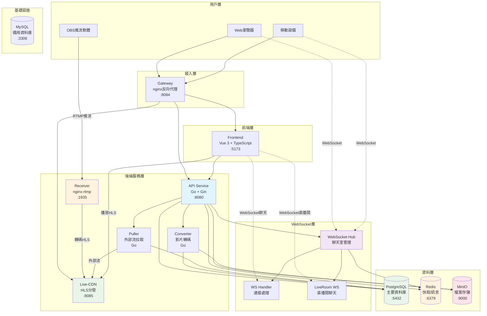
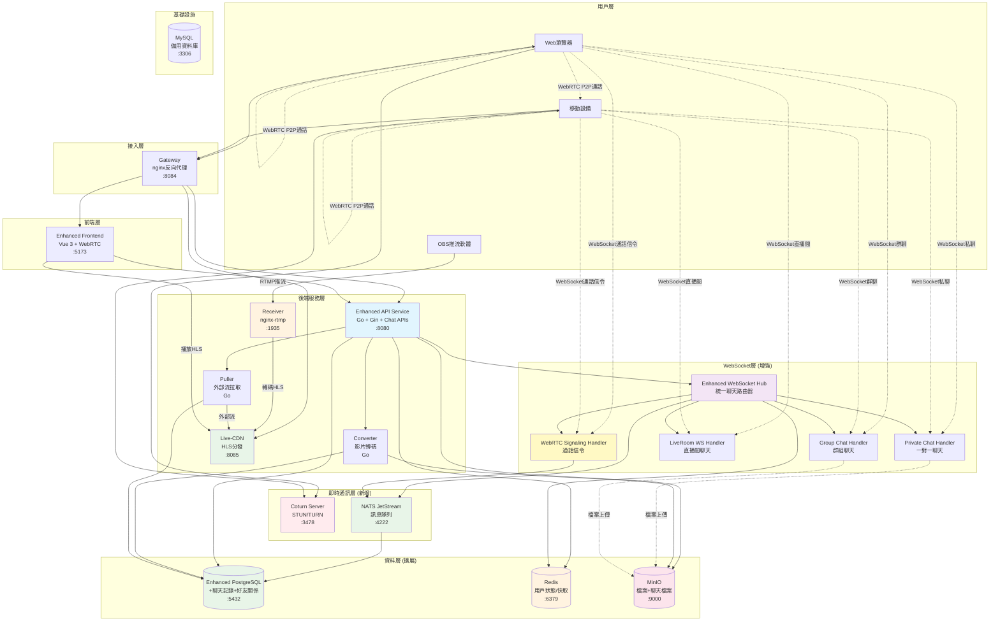
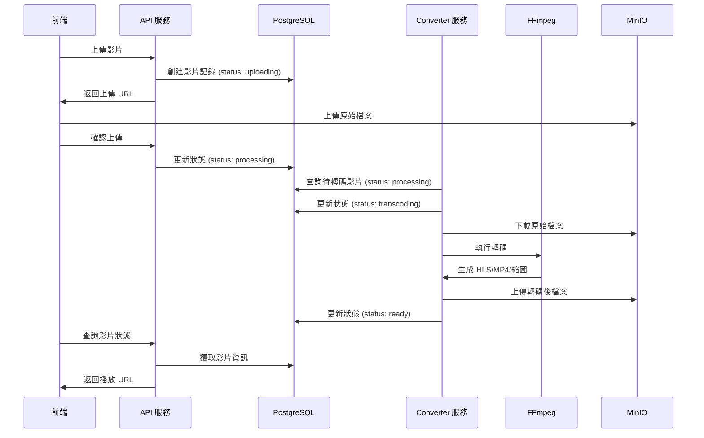
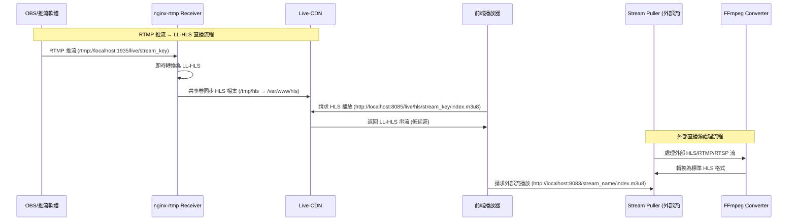
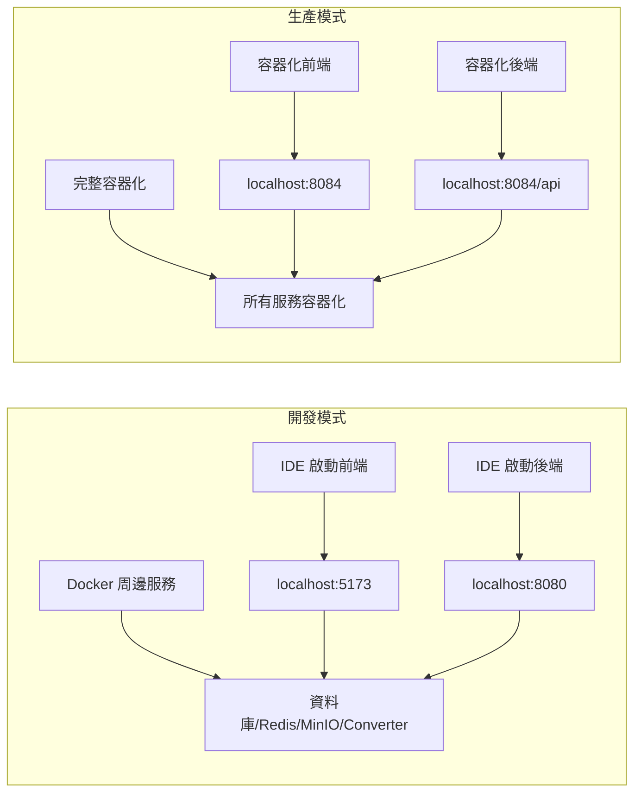

# 🎬 串流平台專案

## 📋 目錄

- [📋 專案概述](#-專案概述)
- [🏗️ 技術架構](#️-技術架構)
- [🚀 快速開始](#-快速開始)
- [📺 直播間使用](#-直播間使用)
- [🎬 影片管理](#-影片管理)
- [🌐 公開直播](#-公開直播)
- [🔧 開發調試](#-開發調試)
- [📊 功能完成度](#-功能完成度)
- [🐛 已知問題](#-已知問題)
- [📚 文檔](#-文檔)

## 📋 專案概述

現代化全棧串流平台，提供影片上傳、自動轉碼、直播間管理和公開直播功能。採用 **PostgreSQL + Redis 混合架構**，整合 **MinIO 對象存儲** 和 **獨立 FFmpeg 轉碼服務**。**正在開發 LINE 級別的即時通訊功能**，包括一對一聊天、群組聊天、音視訊通話和檔案分享。

### 📊 專案統計
- **總檔案數**: 200+ 個核心檔案
- **後端**: 100+ 個 Go 檔案，30+ 個測試檔案
- **前端**: 40+ 個 Vue 組件，30+ 個 TypeScript 檔案
- **專案大小**: 77MB (清理後)
- **文檔**: 10+ 個詳細技術文檔

### 🎯 核心特色
- ✅ **混合架構**: PostgreSQL 主資料庫 + Redis 緩存與訊息
- ✅ **獨立轉碼服務**: Converter 服務專門處理影片轉碼，API 服務專注業務邏輯
- ✅ **智能轉碼**: 背景服務自動生成多品質 HLS 和 MP4
- ✅ **雙桶存儲**: 原始檔案與轉碼後檔案分離
- ✅ **直播間系統**: RTMP 推流 + LL-HLS 播放 + 低延遲 + 靜態緩存 CDN
- ✅ **公開直播**: 外部直播源自動拉取和轉換
- ✅ **即時通信**: WebSocket + Redis Pub/Sub
- 🔄 **全功能即時通訊 (開發中)**: 
  - 一對一/群組聊天
  - 音視訊通話 (WebRTC)
  - 檔案分享 (圖片/影片/文件)
  - 好友系統管理
  - 訊息持久化 (NATS JetStream)
- ✅ **現代前端**: Vue 3 + TypeScript + Element Plus + hls.js
- ✅ **完整 Docker**: 一鍵啟動開發環境
- ✅ **模組化架構**: 依賴注入 + 統一路由管理
- ✅ **自動化推流**: RTMP 推流自動觸發 HLS 轉換
- ✅ **數據清理**: 關閉直播間時自動清除 Redis 數據
- ✅ **微服務架構**: 服務分離為 converter, receiver, puller, live-cdn, gateway
- ✅ **自動轉碼**: 影片上傳後自動觸發 FFmpeg 轉碼處理

## 🏗️ 技術架構

### 現有服務架構



### 即時通訊升級架構



### 影片轉碼架構



### 直播架構



### 開發/生產模式



### 專案結構

```
stream-demo/
├── .vscode/                    # VS Code 開發配置
│   ├── launch.json            # 啟動配置 (F5 一鍵啟動)
│   ├── tasks.json             # 任務配置 (預啟動任務)
│   └── settings.json          # 工作區設置
├── services/                   # 微服務架構
│   ├── api/                   # 後端 API 服務 (Go/Gin)
│   │   ├── api/              # API 路由和處理器
│   │   ├── cmd/              # 命令行工具
│   │   ├── config/           # 配置管理
│   │   ├── database/         # 資料庫模型和遷移
│   │   │   └── models/       # 資料模型
│   │   │       ├── chat.go        # 聊天相關模型 (新增規劃)
│   │   │       ├── friendship.go  # 好友關係模型 (新增規劃)
│   │   │       └── ...
│   │   ├── di/               # 依賴注入容器
│   │   ├── dto/              # 數據傳輸對象
│   │   │   ├── chat.go       # 聊天DTO (新增規劃)
│   │   │   └── ...
│   │   ├── middleware/       # 中間件
│   │   ├── pkg/              # 共用套件
│   │   ├── repositories/     # 資料庫操作層
│   │   │   └── postgresql/   # PostgreSQL倉儲
│   │   │       ├── chat.go        # 聊天記錄倉儲 (新增規劃)
│   │   │       ├── friendship.go  # 好友關係倉儲 (新增規劃)
│   │   │       └── ...
│   │   ├── services/         # 業務邏輯層
│   │   │   ├── chat.go       # 聊天服務 (新增規劃)
│   │   │   ├── friendship.go # 好友服務 (新增規劃)
│   │   │   ├── webrtc.go     # WebRTC信令服務 (新增規劃)
│   │   │   └── ...
│   │   ├── test/             # 測試檔案
│   │   ├── utils/            # 工具函數
│   │   ├── ws/               # WebSocket 處理 (增強規劃)
│   │   │   ├── hub.go        # WebSocket Hub (擴展)
│   │   │   ├── chat_handler.go     # 私聊處理器 (新增規劃)
│   │   │   ├── group_handler.go    # 群聊處理器 (新增規劃)
│   │   │   ├── call_handler.go     # 通話信令處理器 (新增規劃)
│   │   │   └── ...
│   │   ├── .env.example      # 環境變數範例
│   │   ├── go.mod            # Go 模組配置
│   │   └── main.go           # 主程式入口
│   ├── frontend/              # 前端服務 (Vue 3/TypeScript) (增強規劃)
│   │   ├── src/              # 源碼目錄
│   │   │   ├── api/          # API 調用
│   │   │   │   ├── chat.ts        # 聊天API (新增規劃)
│   │   │   │   ├── friendship.ts  # 好友API (新增規劃)
│   │   │   │   └── ...
│   │   │   ├── components/   # Vue 組件 (增強規劃)
│   │   │   │   ├── chat/          # 聊天組件 (新增規劃)
│   │   │   │   │   ├── ChatList.vue     # 聊天列表
│   │   │   │   │   ├── ChatWindow.vue   # 聊天視窗
│   │   │   │   │   ├── MessageInput.vue # 訊息輸入
│   │   │   │   │   └── FileUpload.vue   # 檔案上傳
│   │   │   │   ├── webrtc/        # WebRTC組件 (新增規劃)
│   │   │   │   │   ├── VideoCall.vue    # 視訊通話
│   │   │   │   │   ├── AudioCall.vue    # 語音通話
│   │   │   │   │   └── CallControls.vue # 通話控制
│   │   │   │   └── ...
│   │   │   ├── router/       # 路由配置
│   │   │   ├── store/        # 狀態管理 (增強規劃)
│   │   │   │   ├── chat.ts        # 聊天狀態 (新增規劃)
│   │   │   │   ├── friends.ts     # 好友狀態 (新增規劃)
│   │   │   │   ├── webrtc.ts      # 通話狀態 (新增規劃)
│   │   │   │   └── ...
│   │   │   ├── types/        # TypeScript 類型定義 (增強規劃)
│   │   │   │   ├── chat.ts        # 聊天類型 (新增規劃)
│   │   │   │   ├── webrtc.ts      # WebRTC類型 (新增規劃)
│   │   │   │   └── ...
│   │   │   ├── utils/        # 工具函數 (增強規劃)
│   │   │   │   ├── webrtc.ts      # WebRTC工具 (新增規劃)
│   │   │   │   ├── chat.ts        # 聊天工具 (新增規劃)
│   │   │   │   └── ...
│   │   │   └── views/        # 頁面組件 (增強規劃)
│   │   │       ├── chat/          # 聊天頁面 (新增規劃)
│   │   │       │   ├── ChatView.vue     # 聊天主頁
│   │   │       │   ├── FriendsView.vue  # 好友列表
│   │   │       │   └── CallView.vue     # 通話頁面
│   │   │       └── ...
│   │   ├── .env.example      # 環境變數範例
│   │   ├── package.json      # 依賴配置
│   │   └── vite.config.ts    # Vite 配置
│   ├── receiver/              # RTMP 接收服務 (nginx-rtmp)
│   │   ├── nginx.conf        # nginx 配置
│   │   └── Dockerfile        # 容器配置
│   ├── puller/                # 串流拉取服務 (Go)
│   │   ├── main.go           # 主程式
│   │   ├── go.mod            # Go 模組配置
│   │   └── Dockerfile        # 容器配置
│   ├── converter/             # 媒體轉換服務 (Go + FFmpeg)
│   │   ├── main.go           # Go 主程式
│   │   ├── go.mod            # Go 模組配置
│   │   ├── scripts/          # 轉碼腳本
│   │   └── Dockerfile        # 容器配置
│   ├── live-cdn/              # HLS 靜態緩存 CDN 服務 (nginx)
│   │   ├── nginx.conf        # nginx 配置 (開發模式)
│   │   ├── nginx-cdn-secure.conf # nginx 配置 (生產模式安全)
│   │   └── Dockerfile        # 容器配置
│   └── gateway/               # 反向代理服務 (nginx)
│       ├── nginx-reverse-proxy-dev.conf    # 開發模式配置
│       ├── nginx-reverse-proxy-prod.conf   # 生產模式配置
│       └── Dockerfile.reverse-proxy-dev    # 開發模式容器
├── infrastructure/            # 基礎設施配置 (增強規劃)
│   ├── postgresql/           # PostgreSQL 配置
│   │   ├── init/             # 初始化腳本
│   │   │   ├── 04-chat-init.sql      # 聊天系統初始化 (新增規劃)
│   │   │   ├── 05-friendship-init.sql # 好友系統初始化 (新增規劃)
│   │   │   └── ...
│   │   └── conf/             # 配置檔案
│   ├── mysql/                # MySQL 配置
│   │   ├── init/             # 初始化腳本
│   │   └── conf/             # 配置檔案
│   ├── redis/                # Redis 配置
│   │   └── redis.conf        # Redis 配置檔案
│   ├── minio/                # MinIO 配置
│   │   ├── cors.json         # CORS 配置
│   │   └── init-bucket.sh    # 桶初始化腳本
│   ├── nats/                 # NATS 配置 (新增規劃)
│   │   ├── nats.conf         # NATS 服務器配置
│   │   └── jetstream.conf    # JetStream 配置
│   └── coturn/               # Coturn 配置 (新增規劃)
│       ├── turnserver.conf   # TURN 服務器配置
│       └── users.txt         # 用戶配置
├── deploy/                   # 部署配置
│   ├── docker-compose.yml    # 生產環境配置
│   ├── docker-compose.dev.yml # 開發環境配置
│   ├── env/                  # 環境變數範例
│   └── scripts/              # 管理腳本
│       ├── docker-manage.sh  # Docker 服務管理
│       ├── start.sh          # 開發環境啟動腳本
│       ├── manage.sh         # 簡化管理腳本
│       ├── deploy.sh         # 部署腳本
│       └── diagnose.sh       # 診斷腳本
└── docs/                     # 技術文檔
    ├── DEVELOPMENT.md        # 開發指南
    ├── DEPLOYMENT.md         # 部署指南
    ├── CONFIGURATION.md      # 配置說明
    ├── PROJECT_STRUCTURE.md  # 專案結構說明
    └── ...                   # 其他技術文檔
```

### 技術棧
- **前端**: Vue 3.4.15, TypeScript 5.3, Element Plus 2.5.3, hls.js 1.6.7, Pinia 2.1.7
- **後端**: Go 1.24.3, Gin 1.10.1, GORM 1.30.0, JWT 5.2.2, 依賴注入
- **轉碼服務**: Go 1.21, FFmpeg 6.0.1, 資料庫驅動任務管理
- **資料庫**: PostgreSQL 15, Redis 7, MySQL 8.0
- **存儲**: MinIO (S3 兼容)
- **直播**: nginx-rtmp (Receiver), nginx (Live-CDN), stream-puller (Puller)
- **即時通訊 (規劃中)**: 
  - **訊息隊列**: NATS JetStream (訊息持久化)
  - **音視訊**: WebRTC + Coturn (STUN/TURN)
  - **信令**: WebSocket + Go 信令服務
  - **檔案分享**: 整合現有 MinIO 系統
- **容器**: Docker & Docker Compose
- **開發工具**: Vite 5.0.11, ESLint, Prettier, Vue TSC

## 🚀 快速開始

### 開發模式 (推薦用於本地開發)

#### 方式一：F5 一鍵啟動（最簡單）
```bash
# 按 F5 或 Fn+F5 自動執行
# 會自動檢查依賴、啟動周邊服務、啟動前後端
# 
# 自動化流程：
# 1. 執行預啟動任務 (🎯 智能啟動開發環境)
#    - 檢查環境依賴 (Docker, Node.js, Go)
#    - 安裝前端和後端依賴
#    - 檢查並啟動周邊服務 (PostgreSQL, Redis, MinIO, Gateway, Converter)
# 2. 啟動後端服務 (🚀 啟動後端 (本地環境))
#    - 使用 services/api/.env 環境變數
#    - 在 services/api 目錄中運行
# 3. 啟動前端服務 (🎨 啟動前端 (本地環境))
#    - 使用 services/frontend/.env 環境變數
#    - 在 services/frontend 目錄中運行
```

#### 方式二：手動啟動
```bash
# 1. 啟動周邊服務
cd deploy
./scripts/docker-manage.sh start-dev

# 2. 初始化服務
./scripts/docker-manage.sh init      # 初始化 MinIO 桶
./scripts/docker-manage.sh init-live # 初始化直播服務

# 3. 在 IDE 中啟動前後端
# 後端: 使用 launch.json 配置
# 前端: npm run dev
```

#### 訪問應用
- **統一入口**: http://localhost:8084
- **前端 (IDE)**: http://localhost:5173
- **後端 (IDE)**: http://localhost:8080
- **MinIO Console**: http://localhost:9001 (minioadmin/minioadmin)
- **直播流服務**: http://localhost:8083
- **HLS 靜態緩存**: http://localhost:8085
- **RTMP 推流**: rtmp://localhost:1935/live
- **HLS 播放 (直播間)**: http://localhost:8085/live/hls/[stream_key]/index.m3u8
- **HLS 播放 (外部流)**: http://localhost:8083/[stream_name]/index.m3u8

### 生產模式 (完整容器化部署)

#### 1. 啟動所有服務
```bash
cd deploy
./scripts/docker-manage.sh start
```

#### 2. 初始化服務
```bash
./scripts/docker-manage.sh init      # 初始化 MinIO 桶
./scripts/docker-manage.sh init-live # 初始化直播服務
```

#### 3. 訪問應用
- **統一入口**: http://localhost:8084
- **前端**: http://localhost:8084
- **後端 API**: http://localhost:8084/api
- **MinIO Console**: http://localhost:9001 (minioadmin/minioadmin)
- **直播流服務**: http://localhost:8083
- **HLS 靜態緩存**: http://localhost:8085
- **RTMP 推流**: rtmp://localhost:1935/live
- **HLS 播放 (直播間)**: http://localhost:8085/live/hls/[stream_key]/index.m3u8
- **HLS 播放 (外部流)**: http://localhost:8083/[stream_name]/index.m3u8

> 💡 **開發模式優勢**: 前後端由 IDE 啟動，支援熱重載，適合本地開發。詳細說明請參考 [開發指南](./docs/DEVELOPMENT.md)

### 🔧 環境配置說明

#### 開發模式配置
- **nginx-reverse-proxy-dev.conf**: 連接到 `host.docker.internal` (主機服務)
- **Dockerfile.reverse-proxy-dev**: 開發模式專用映像檔
- **前後端**: 由 IDE 啟動，支援熱重載
- **環境變數**: 使用 `services/api/.env` 和 `services/frontend/.env` 檔案管理

#### 生產模式配置  
- **nginx-reverse-proxy.conf**: 連接到容器內服務 (`frontend:80`, `api:8080`)
- **Dockerfile.reverse-proxy-prod**: 生產模式專用映像檔
- **前後端**: 容器化部署，完整隔離

### 🛠️ VS Code 開發配置

#### launch.json 配置
- **🚀 啟動後端 (本地環境)**: 使用 `services/api/.env` 環境變數
- **🎨 啟動前端 (本地環境)**: 使用 `services/frontend/.env` 環境變數
- **🧪 運行後端測試**: 測試配置
- **🚀 F5 一鍵啟動 (本地環境)**: 複合配置，自動執行預啟動任務

#### tasks.json 配置
- **npm-install-frontend**: 安裝前端依賴
- **go-mod-tidy**: 整理後端依賴
- **build-frontend**: 建置前端
- **檢查開發環境**: 檢查開發環境狀態
- **🎯 智能啟動開發環境**: F5 預啟動任務，自動檢查並啟動周邊服務

## 📺 直播間使用

#### 生命週期概念
- **開始/結束直播** = 狀態切換（在同一直播間內循環）
- **創建/關閉直播間** = 生命週期流程（創建→關閉）

#### 狀態流程
```
created → live → ended → live → ended → ... (循環)
    ↓
closed (完全刪除)
```

### 基本操作
1. **創建直播間**: 登入後點擊"創建直播間"，填寫標題和描述
2. **開始直播**: 使用推流密鑰在 OBS 等軟體中推流，點擊"開始直播"
3. **結束直播**: 點擊"結束直播"，直播間保留，可重新開始
4. **重新開始**: 在已結束的直播間中點擊"重新開始直播"
5. **加入直播間**: 瀏覽列表，點擊加入感興趣的直播間
6. **離開直播間**: 觀眾可主動離開，自動跳轉回列表
7. **關閉直播間**: 只有創建者可關閉，完全刪除數據並清除 Redis 緩存

### 數據清理
當主播關閉直播間時，系統會自動清除：
- 房間基本信息
- 用戶列表和角色
- 聊天記錄
- 從活躍房間列表移除

## 🎬 OBS 推流設置

### 1. 獲取推流資訊
1. 登入前端: http://localhost:5173
2. 創建直播間或進入現有直播間
3. 點擊"串流資訊"按鈕
4. 複製以下資訊：
   - **串流金鑰**: `stream_xxxxxxxx`
   - **RTMP 推流地址**: `rtmp://localhost:1935/live/stream_xxxxxxxx`

### 2. OBS 設置
1. **打開 OBS Studio**
2. **設置 → 串流**
3. **服務**: 選擇"自訂"
4. **伺服器**: 填入 `rtmp://localhost:1935/live`
5. **串流金鑰**: 填入您的串流金鑰（如：`stream_xxxxxxxx`）

### 3. 開始推流
1. 在 OBS 中點擊"開始串流"
2. 回到前端直播間，點擊"開始直播"
3. 系統會自動：
   - Receiver (nginx-rtmp) 接收 RTMP 推流
   - 即時轉換為 LL-HLS (Low Latency HLS) 格式
   - 通過共享卷同步到 Live-CDN 服務
   - Live-CDN 提供靜態緩存和 CORS 支持
   - 前端通過 `hls.js` 播放低延遲直播流
4. 等待幾秒鐘，直播畫面應該會出現在前端播放器中

### 4. 其他推流軟體
- **Streamlabs OBS**: 設置方式相同
- **XSplit**: 設置方式相同
- **手機 App**: 支援 RTMP 推流的 App 都可以使用

## 🎯 Live-CDN 靜態緩存服務

### 服務特色
- **專用 HLS 服務**: 專門為直播間 HLS 流提供靜態緩存服務
- **低延遲優化**: 支援 LL-HLS (Low Latency HLS) 超低延遲播放
- **CORS 支持**: 完整的跨域請求支持，適配前端 hls.js 播放器
- **性能優化**: nginx 靜態文件服務，緩存策略優化
- **檔案同步**: 通過 Docker 共享卷即時同步 HLS 檔案

### 架構設計
```
OBS 推流 (RTMP) → Receiver (nginx-rtmp) → HLS 檔案生成 → Live-CDN (nginx) → 前端播放
                                          ↑                    ↓
                                     共享卷同步          靜態緩存服務
                                    /tmp/hls         /var/www/hls
```

### 訪問端點
- **服務地址**: http://localhost:8085
- **HLS 播放路徑**: `/live/hls/{stream_key}/index.m3u8`
- **範例**: http://localhost:8085/live/hls/stream_57409a55-4cb/index.m3u8
- **健康檢查**: http://localhost:8085/health

### 配置特色
- **開發模式**: 允許所有來源 CORS，便於本地開發
- **生產模式**: 安全 CORS 配置，包含 Referer 檢查和速率限制
- **文件類型**: 正確設置 `.m3u8` 和 `.ts` 檔案 MIME 類型
- **緩存策略**: `no-cache` 策略確保直播流的即時性

## 🌐 公開直播

### 功能特色
- **外部直播源**: 自動拉取外部 HLS、RTMP、RTSP 流
- **自動轉換**: 統一轉換為 HLS 格式
- **分類管理**: 支援測試、太空、新聞、體育等分類
- **狀態監控**: 實時監控直播源狀態

### 訪問方式
- **公開直播列表**: http://localhost:5173/public-streams
- **管理介面**: http://localhost:5173/public-streams/manage (需要登入)

## 🎬 影片管理

### 轉碼流程
1. **上傳影片**: 選擇檔案，系統自動轉碼
2. **狀態管理**: 
   - `uploading` → `processing` → `transcoding` → `ready`
3. **多品質播放**: 自動生成 720p, 480p, 360p HLS 串流
4. **縮圖生成**: 自動提取影片縮圖
5. **播放統計**: 記錄播放次數和時長

### 轉碼服務架構
- **API 服務**: 專注於 HTTP API 和業務邏輯，不包含轉碼邏輯
- **Converter 服務**: 獨立服務，專門處理影片轉碼
  - 從資料庫查詢待轉碼影片 (`status = 'processing'`)
  - 執行 FFmpeg 轉碼處理
  - 更新影片狀態和 URL
  - 支援多工作協程並發處理

### 轉碼配置
- **工作協程數**: 可通過 `WORKER_COUNT` 環境變數配置
- **轉碼格式**: HLS (多品質) + MP4 (網頁播放) + 縮圖
- **存儲分離**: 原始檔案與轉碼後檔案分別存儲在不同 MinIO 桶

## 🔧 開發調試

```bash
# 查看服務狀態
./scripts/docker-manage.sh status

# 查看日誌
./scripts/docker-manage.sh logs [service]

# 管理直播流服務
./scripts/docker-manage.sh puller start
./scripts/docker-manage.sh puller status
./scripts/docker-manage.sh puller test

# 查看直播狀態
./scripts/docker-manage.sh live-status

# 運行測試
./scripts/docker-manage.sh test

# 快速診斷
./scripts/diagnose.sh all      # 完整診斷
./scripts/diagnose.sh ports    # 檢查端口衝突
./scripts/diagnose.sh fix      # 自動修復問題

# 健康檢查
./scripts/docker-manage.sh health      # 檢查服務健康狀態
./scripts/docker-manage.sh ports       # 檢查端口佔用
```

### 自動化流程驗證
```bash
# 1. 檢查 RTMP 推流狀態
curl http://localhost:1935/stat

# 2. 檢查 HLS 文件生成
curl http://localhost:8083/[stream_key]/index.m3u8

# 3. 檢查 puller 日誌
docker-compose logs puller --tail=20

# 4. 檢查 converter 服務狀態
docker-compose logs converter --tail=20
```

## 📊 功能完成度

### 高優先級 ✅ 已完成
- [x] **直播間基礎功能**: 創建、加入、開始/結束直播
- [x] **直播間聊天系統**: 實時聊天、用戶加入/離開通知
- [x] **角色權限管理**: 創建者/觀眾權限區分
- [x] **實時通知系統**: WebSocket 實時通知直播狀態變化
- [x] **統一踢出功能**: 關閉直播間時自動踢出所有用戶
- [x] **離開直播間功能**: 用戶離開時自動跳轉回列表
- [x] **直播間持久化**: 結束直播時保留直播間，只有關閉才刪除
- [x] **直播間生命週期**: 開始/結束直播為狀態切換，創建/關閉為生命週期
- [x] **重新開始直播**: 已結束的直播間可以重新開始
- [x] **RTMP 推流支援**: Receiver (nginx-rtmp) 接收推流，Puller 轉換 HLS
- [x] **自動化推流處理**: RTMP 推流自動觸發 HLS 轉換
- [x] **前端 HLS 播放**: hls.js 整合，支援自動重試和低延遲
- [x] **服務管理整合**: docker-manage.sh 統一管理所有服務
- [x] **數據清理機制**: 關閉直播間時自動清除 Redis 數據
- [x] **公開直播系統**: 外部直播源自動拉取和轉換
- [x] **微服務架構**: 服務重構為 converter, receiver, puller
- [x] **獨立轉碼服務**: Converter 服務專門處理影片轉碼，API 服務專注業務邏輯

### 中優先級 ✅ 已完成
- [x] **影片上傳**: 支援多格式上傳
- [x] **自動轉碼**: Converter (FFmpeg) 背景服務自動處理
- [x] **多品質播放**: HLS 自適應串流
- [x] **用戶認證**: JWT 登入註冊
- [x] **檔案管理**: 影片列表和刪除
- [x] **播放統計**: 觀看次數和時長統計 ✅
- [ ] **搜尋功能**: 影片標題和標籤搜尋

### 即時通訊功能開發路徑 🆕

#### 階段一：基礎聊天功能 (2-3週)
- [ ] **資料庫結構擴展**: 聊天記錄、好友關係、群組資料表
- [ ] **後端API開發**: 聊天、好友管理相關API
- [ ] **WebSocket系統增強**: 支援一對一、群組聊天路由
- [ ] **NATS訊息隊列**: 訊息持久化和分發系統
- [ ] **前端聊天界面**: 基本聊天列表和訊息視窗
- [ ] **好友系統**: 好友申請、接受、管理功能

#### 階段二：檔案分享功能 (1-2週)  
- [ ] **檔案上傳整合**: 複用現有MinIO系統支援聊天檔案
- [ ] **多媒體預覽**: 圖片、影片在聊天中的預覽功能
- [ ] **檔案管理**: 聊天檔案的下載、刪除管理
- [ ] **檔案安全**: 檔案存取權限和安全檢查

#### 階段三：音視訊通話 (3-4週)
- [ ] **Coturn服務部署**: STUN/TURN服務器配置
- [ ] **WebRTC信令服務**: Go後端信令處理邏輯
- [ ] **前端WebRTC整合**: 音視訊通話界面和控制
- [ ] **通話記錄系統**: 通話歷史記錄和統計
- [ ] **通話品質優化**: 網路適應和音視訊編碼優化

#### 階段四：進階功能 (2-3週)
- [ ] **訊息已讀狀態**: 訊息送達和已讀回條
- [ ] **訊息搜尋**: 聊天記錄全文搜尋功能
- [ ] **群組管理**: 群組建立、成員管理、權限控制
- [ ] **推送通知**: 離線訊息推送到移動設備
- [ ] **多端同步**: 確保多設備間訊息同步

### 低優先級 🔄 原有待開發
- [ ] **表情系統**: 聊天表情和禮物
- [ ] **錄製功能**: 直播錄製和回放
- [ ] **CDN 整合**: 外部 CDN 支援
- [ ] **多語言**: 國際化支援

### 📈 開發進度
- **核心功能**: 100% 完成 (16/16) ✅
- **基礎功能**: 100% 完成 (6/6) ✅
- **即時通訊功能**: 0% 完成 (0/16) 🆕
- **進階功能**: 0% 完成 (0/4)
- **整體進度**: 59% 完成 (22/42)

## 🐛 已知問題

- **HLS 播放器初始化**: 已修復用戶加入已開始直播時的播放器初始化問題
- **服務重命名**: 已完成 media-service → converter, rtmp-service → receiver, stream-puller → puller
- **專案結構優化**: 已完成微服務架構重構，清理多餘文件
- **F5 一鍵啟動**: 已修復路徑問題和服務名稱檢查，現在可以正常使用
- **轉碼服務配置**: 已修復 converter 服務容器名稱配置錯誤問題
- **前端代理配置**: 已修復 HLS 文件訪問路徑重複問題
- **公開直播路徑**: 已修復前端硬編碼 HLS URL 路徑問題
- **轉碼服務架構**: 已完成 API 服務轉碼邏輯移除，Converter 服務獨立處理轉碼

## 📚 文檔

### 核心文檔
- **[開發指南](./docs/DEVELOPMENT.md)** - 詳細的開發環境設置和調試指南
- **[部署指南](./docs/DEPLOYMENT.md)** - 生產環境部署和維護指南
- **[配置說明](./docs/CONFIGURATION.md)** - 環境變數和配置選項說明
- **[專案結構](./docs/PROJECT_STRUCTURE.md)** - 專案目錄結構說明

### 開發文檔
- **[GitHub CI 設置](./docs/GITHUB_CI_SETUP.md)** - CI/CD 流程配置
- **[分支保護](./docs/BRANCH_PROTECTION.md)** - 分支保護規則設置
- **[前端建置測試](./docs/FRONTEND_BUILD_TEST.md)** - 前端測試和建置指南

### 專案文檔
- **[服務重命名總結](./docs/SERVICE_RENAME_SUMMARY.md)** - 服務重構和重命名記錄
- **[開發環境 Gateway 設置](./docs/DEV_GATEWAY_SETUP.md)** - 開發環境反向代理配置
