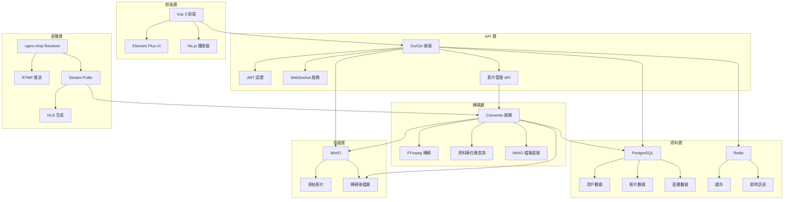
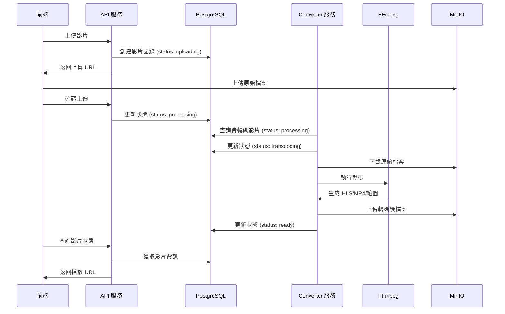
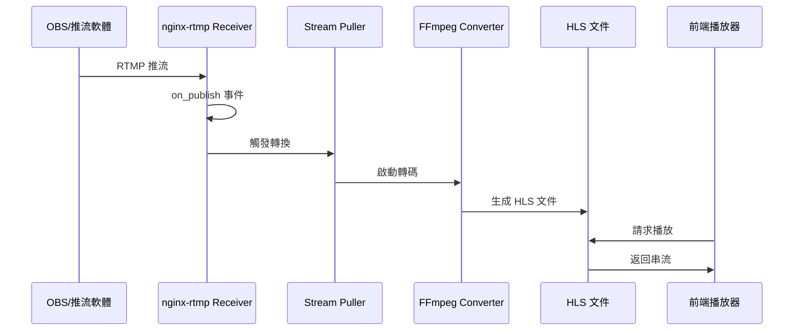
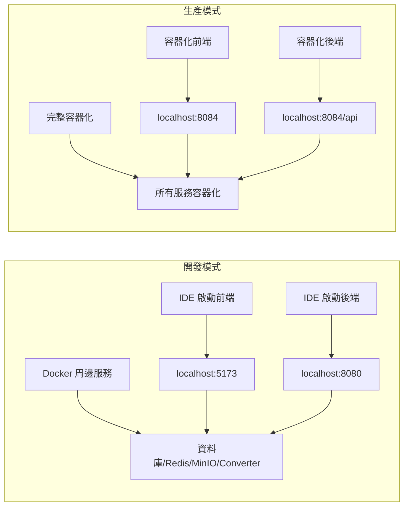

# 🎬 串流平台專案

## 📋 目錄

- [📋 專案概述](#-專案概述)
- [🏗️ 技術架構](#️-技術架構)
- [🚀 快速開始](#-快速開始)
- [📺 直播間使用](#-直播間使用)
- [🎬 影片管理](#-影片管理)
- [🌐 公開直播](#-公開直播)
- [🔧 開發調試](#-開發調試)
- [📊 功能完成度](#-功能完成度)
- [🐛 已知問題](#-已知問題)
- [📚 文檔](#-文檔)

## 📋 專案概述

現代化全棧串流平台，提供影片上傳、自動轉碼、直播間管理和公開直播功能。採用 **PostgreSQL + Redis 混合架構**，整合 **MinIO 對象存儲** 和 **獨立 FFmpeg 轉碼服務**。

### 📊 專案統計
- **總檔案數**: 200+ 個核心檔案
- **後端**: 100+ 個 Go 檔案，30+ 個測試檔案
- **前端**: 40+ 個 Vue 組件，30+ 個 TypeScript 檔案
- **專案大小**: 77MB (清理後)
- **文檔**: 10+ 個詳細技術文檔

### 🎯 核心特色
- ✅ **混合架構**: PostgreSQL 主資料庫 + Redis 緩存與訊息
- ✅ **獨立轉碼服務**: Converter 服務專門處理影片轉碼，API 服務專注業務邏輯
- ✅ **智能轉碼**: 背景服務自動生成多品質 HLS 和 MP4
- ✅ **雙桶存儲**: 原始檔案與轉碼後檔案分離
- ✅ **直播間系統**: RTMP 推流 + HLS 播放 + 低延遲 + 自動化轉換
- ✅ **公開直播**: 外部直播源自動拉取和轉換
- ✅ **即時通信**: WebSocket + Redis Pub/Sub
- ✅ **現代前端**: Vue 3 + TypeScript + Element Plus + hls.js
- ✅ **完整 Docker**: 一鍵啟動開發環境
- ✅ **模組化架構**: 依賴注入 + 統一路由管理
- ✅ **自動化推流**: RTMP 推流自動觸發 HLS 轉換
- ✅ **數據清理**: 關閉直播間時自動清除 Redis 數據
- ✅ **微服務架構**: 服務分離為 converter, receiver, puller, gateway
- ✅ **自動轉碼**: 影片上傳後自動觸發 FFmpeg 轉碼處理

## 🏗️ 技術架構

### 整體架構



### 影片轉碼架構



### 直播架構



### 開發/生產模式



### 專案結構

```
stream-demo/
├── .vscode/                    # VS Code 開發配置
│   ├── launch.json            # 啟動配置 (F5 一鍵啟動)
│   ├── tasks.json             # 任務配置 (預啟動任務)
│   └── settings.json          # 工作區設置
├── services/                   # 微服務架構
│   ├── api/                   # 後端 API 服務 (Go/Gin)
│   │   ├── api/              # API 路由和處理器
│   │   ├── cmd/              # 命令行工具
│   │   ├── config/           # 配置管理
│   │   ├── database/         # 資料庫模型和遷移
│   │   ├── di/               # 依賴注入容器
│   │   ├── dto/              # 數據傳輸對象
│   │   ├── middleware/       # 中間件
│   │   ├── pkg/              # 共用套件
│   │   ├── repositories/     # 資料庫操作層
│   │   ├── services/         # 業務邏輯層
│   │   ├── test/             # 測試檔案
│   │   ├── utils/            # 工具函數
│   │   ├── ws/               # WebSocket 處理
│   │   ├── .env.example      # 環境變數範例
│   │   ├── go.mod            # Go 模組配置
│   │   └── main.go           # 主程式入口
│   ├── frontend/              # 前端服務 (Vue 3/TypeScript)
│   │   ├── src/              # 源碼目錄
│   │   │   ├── api/          # API 調用
│   │   │   ├── components/   # Vue 組件
│   │   │   ├── router/       # 路由配置
│   │   │   ├── store/        # 狀態管理
│   │   │   ├── types/        # TypeScript 類型定義
│   │   │   ├── utils/        # 工具函數
│   │   │   └── views/        # 頁面組件
│   │   ├── .env.example      # 環境變數範例
│   │   ├── package.json      # 依賴配置
│   │   └── vite.config.ts    # Vite 配置
│   ├── receiver/              # RTMP 接收服務 (nginx-rtmp)
│   │   ├── nginx.conf        # nginx 配置
│   │   └── Dockerfile        # 容器配置
│   ├── puller/                # 串流拉取服務 (Go)
│   │   ├── main.go           # 主程式
│   │   ├── go.mod            # Go 模組配置
│   │   └── Dockerfile        # 容器配置
│   ├── converter/             # 媒體轉換服務 (Go + FFmpeg)
│   │   ├── main.go           # Go 主程式
│   │   ├── go.mod            # Go 模組配置
│   │   ├── scripts/          # 轉碼腳本
│   │   └── Dockerfile        # 容器配置
│   └── gateway/               # 反向代理服務 (nginx)
│       ├── nginx-reverse-proxy-dev.conf    # 開發模式配置
│       ├── nginx-reverse-proxy-prod.conf   # 生產模式配置
│       └── Dockerfile.reverse-proxy-dev    # 開發模式容器
├── infrastructure/            # 基礎設施配置
│   ├── postgresql/           # PostgreSQL 配置
│   │   ├── init/             # 初始化腳本
│   │   └── conf/             # 配置檔案
│   ├── mysql/                # MySQL 配置
│   │   ├── init/             # 初始化腳本
│   │   └── conf/             # 配置檔案
│   ├── redis/                # Redis 配置
│   │   └── redis.conf        # Redis 配置檔案
│   └── minio/                # MinIO 配置
│       ├── cors.json         # CORS 配置
│       └── init-bucket.sh    # 桶初始化腳本
├── deploy/                   # 部署配置
│   ├── docker-compose.yml    # 生產環境配置
│   ├── docker-compose.dev.yml # 開發環境配置
│   ├── env/                  # 環境變數範例
│   └── scripts/              # 管理腳本
│       ├── docker-manage.sh  # Docker 服務管理
│       ├── start.sh          # 開發環境啟動腳本
│       ├── manage.sh         # 簡化管理腳本
│       ├── deploy.sh         # 部署腳本
│       └── diagnose.sh       # 診斷腳本
└── docs/                     # 技術文檔
    ├── DEVELOPMENT.md        # 開發指南
    ├── DEPLOYMENT.md         # 部署指南
    ├── CONFIGURATION.md      # 配置說明
    ├── PROJECT_STRUCTURE.md  # 專案結構說明
    └── ...                   # 其他技術文檔
```

### 技術棧
- **前端**: Vue 3.4.15, TypeScript 5.3, Element Plus 2.5.3, hls.js 1.6.7, Pinia 2.1.7
- **後端**: Go 1.24.3, Gin 1.10.1, GORM 1.30.0, JWT 5.2.2, 依賴注入
- **轉碼服務**: Go 1.21, FFmpeg 6.0.1, 資料庫驅動任務管理
- **資料庫**: PostgreSQL 15, Redis 7, MySQL 8.0
- **存儲**: MinIO (S3 兼容)
- **直播**: nginx-rtmp (Receiver), stream-puller (Puller)
- **容器**: Docker & Docker Compose
- **開發工具**: Vite 5.0.11, ESLint, Prettier, Vue TSC

## 🚀 快速開始

### 開發模式 (推薦用於本地開發)

#### 方式一：F5 一鍵啟動（最簡單）
```bash
# 按 F5 或 Fn+F5 自動執行
# 會自動檢查依賴、啟動周邊服務、啟動前後端
# 
# 自動化流程：
# 1. 執行預啟動任務 (🎯 智能啟動開發環境)
#    - 檢查環境依賴 (Docker, Node.js, Go)
#    - 安裝前端和後端依賴
#    - 檢查並啟動周邊服務 (PostgreSQL, Redis, MinIO, Gateway, Converter)
# 2. 啟動後端服務 (🚀 啟動後端 (本地環境))
#    - 使用 services/api/.env 環境變數
#    - 在 services/api 目錄中運行
# 3. 啟動前端服務 (🎨 啟動前端 (本地環境))
#    - 使用 services/frontend/.env 環境變數
#    - 在 services/frontend 目錄中運行
```

#### 方式二：手動啟動
```bash
# 1. 啟動周邊服務
cd deploy
./scripts/docker-manage.sh start-dev

# 2. 初始化服務
./scripts/docker-manage.sh init      # 初始化 MinIO 桶
./scripts/docker-manage.sh init-live # 初始化直播服務

# 3. 在 IDE 中啟動前後端
# 後端: 使用 launch.json 配置
# 前端: npm run dev
```

#### 訪問應用
- **統一入口**: http://localhost:8084
- **前端 (IDE)**: http://localhost:5173
- **後端 (IDE)**: http://localhost:8080
- **MinIO Console**: http://localhost:9001 (minioadmin/minioadmin)
- **直播流服務**: http://localhost:8083
- **RTMP 推流**: rtmp://localhost:1935/live
- **HLS 播放**: http://localhost:8083/[stream_key]/index.m3u8

### 生產模式 (完整容器化部署)

#### 1. 啟動所有服務
```bash
cd deploy
./scripts/docker-manage.sh start
```

#### 2. 初始化服務
```bash
./scripts/docker-manage.sh init      # 初始化 MinIO 桶
./scripts/docker-manage.sh init-live # 初始化直播服務
```

#### 3. 訪問應用
- **統一入口**: http://localhost:8084
- **前端**: http://localhost:8084
- **後端 API**: http://localhost:8084/api
- **MinIO Console**: http://localhost:9001 (minioadmin/minioadmin)
- **直播流服務**: http://localhost:8083
- **RTMP 推流**: rtmp://localhost:1935/live
- **HLS 播放**: http://localhost:8083/[stream_key]/index.m3u8

> 💡 **開發模式優勢**: 前後端由 IDE 啟動，支援熱重載，適合本地開發。詳細說明請參考 [開發指南](./docs/DEVELOPMENT.md)

### 🔧 環境配置說明

#### 開發模式配置
- **nginx-reverse-proxy-dev.conf**: 連接到 `host.docker.internal` (主機服務)
- **Dockerfile.reverse-proxy-dev**: 開發模式專用映像檔
- **前後端**: 由 IDE 啟動，支援熱重載
- **環境變數**: 使用 `services/api/.env` 和 `services/frontend/.env` 檔案管理

#### 生產模式配置  
- **nginx-reverse-proxy.conf**: 連接到容器內服務 (`frontend:80`, `api:8080`)
- **Dockerfile.reverse-proxy-prod**: 生產模式專用映像檔
- **前後端**: 容器化部署，完整隔離

### 🛠️ VS Code 開發配置

#### launch.json 配置
- **🚀 啟動後端 (本地環境)**: 使用 `services/api/.env` 環境變數
- **🎨 啟動前端 (本地環境)**: 使用 `services/frontend/.env` 環境變數
- **🧪 運行後端測試**: 測試配置
- **🚀 F5 一鍵啟動 (本地環境)**: 複合配置，自動執行預啟動任務

#### tasks.json 配置
- **npm-install-frontend**: 安裝前端依賴
- **go-mod-tidy**: 整理後端依賴
- **build-frontend**: 建置前端
- **檢查開發環境**: 檢查開發環境狀態
- **🎯 智能啟動開發環境**: F5 預啟動任務，自動檢查並啟動周邊服務

## 📺 直播間使用

#### 生命週期概念
- **開始/結束直播** = 狀態切換（在同一直播間內循環）
- **創建/關閉直播間** = 生命週期流程（創建→關閉）

#### 狀態流程
```
created → live → ended → live → ended → ... (循環)
    ↓
closed (完全刪除)
```

### 基本操作
1. **創建直播間**: 登入後點擊"創建直播間"，填寫標題和描述
2. **開始直播**: 使用推流密鑰在 OBS 等軟體中推流，點擊"開始直播"
3. **結束直播**: 點擊"結束直播"，直播間保留，可重新開始
4. **重新開始**: 在已結束的直播間中點擊"重新開始直播"
5. **加入直播間**: 瀏覽列表，點擊加入感興趣的直播間
6. **離開直播間**: 觀眾可主動離開，自動跳轉回列表
7. **關閉直播間**: 只有創建者可關閉，完全刪除數據並清除 Redis 緩存

### 數據清理
當主播關閉直播間時，系統會自動清除：
- 房間基本信息
- 用戶列表和角色
- 聊天記錄
- 從活躍房間列表移除

## 🎬 OBS 推流設置

### 1. 獲取推流資訊
1. 登入前端: http://localhost:5173
2. 創建直播間或進入現有直播間
3. 點擊"串流資訊"按鈕
4. 複製以下資訊：
   - **串流金鑰**: `stream_xxxxxxxx`
   - **RTMP 推流地址**: `rtmp://localhost:1935/live/stream_xxxxxxxx`

### 2. OBS 設置
1. **打開 OBS Studio**
2. **設置 → 串流**
3. **服務**: 選擇"自訂"
4. **伺服器**: 填入 `rtmp://localhost:1935/live`
5. **串流金鑰**: 填入您的串流金鑰（如：`stream_xxxxxxxx`）

### 3. 開始推流
1. 在 OBS 中點擊"開始串流"
2. 回到前端直播間，點擊"開始直播"
3. 系統會自動：
   - Receiver (nginx-rtmp) 接收推流
   - 觸發 `on_publish` 事件
   - Puller 自動啟動 Converter (FFmpeg) 轉換
   - 生成 HLS 文件
   - 前端 `hls.js` 自動播放（支援自動重試）
4. 等待幾秒鐘，直播畫面應該會出現在前端播放器中

### 4. 其他推流軟體
- **Streamlabs OBS**: 設置方式相同
- **XSplit**: 設置方式相同
- **手機 App**: 支援 RTMP 推流的 App 都可以使用

## 🌐 公開直播

### 功能特色
- **外部直播源**: 自動拉取外部 HLS、RTMP、RTSP 流
- **自動轉換**: 統一轉換為 HLS 格式
- **分類管理**: 支援測試、太空、新聞、體育等分類
- **狀態監控**: 實時監控直播源狀態

### 訪問方式
- **公開直播列表**: http://localhost:5173/public-streams
- **管理介面**: http://localhost:5173/public-streams/manage (需要登入)

## 🎬 影片管理

### 轉碼流程
1. **上傳影片**: 選擇檔案，系統自動轉碼
2. **狀態管理**: 
   - `uploading` → `processing` → `transcoding` → `ready`
3. **多品質播放**: 自動生成 720p, 480p, 360p HLS 串流
4. **縮圖生成**: 自動提取影片縮圖
5. **播放統計**: 記錄播放次數和時長

### 轉碼服務架構
- **API 服務**: 專注於 HTTP API 和業務邏輯，不包含轉碼邏輯
- **Converter 服務**: 獨立服務，專門處理影片轉碼
  - 從資料庫查詢待轉碼影片 (`status = 'processing'`)
  - 執行 FFmpeg 轉碼處理
  - 更新影片狀態和 URL
  - 支援多工作協程並發處理

### 轉碼配置
- **工作協程數**: 可通過 `WORKER_COUNT` 環境變數配置
- **轉碼格式**: HLS (多品質) + MP4 (網頁播放) + 縮圖
- **存儲分離**: 原始檔案與轉碼後檔案分別存儲在不同 MinIO 桶

## 🔧 開發調試

```bash
# 查看服務狀態
./scripts/docker-manage.sh status

# 查看日誌
./scripts/docker-manage.sh logs [service]

# 管理直播流服務
./scripts/docker-manage.sh puller start
./scripts/docker-manage.sh puller status
./scripts/docker-manage.sh puller test

# 查看直播狀態
./scripts/docker-manage.sh live-status

# 運行測試
./scripts/docker-manage.sh test

# 快速診斷
./scripts/diagnose.sh all      # 完整診斷
./scripts/diagnose.sh ports    # 檢查端口衝突
./scripts/diagnose.sh fix      # 自動修復問題

# 健康檢查
./scripts/docker-manage.sh health      # 檢查服務健康狀態
./scripts/docker-manage.sh ports       # 檢查端口佔用
```

### 自動化流程驗證
```bash
# 1. 檢查 RTMP 推流狀態
curl http://localhost:1935/stat

# 2. 檢查 HLS 文件生成
curl http://localhost:8083/[stream_key]/index.m3u8

# 3. 檢查 puller 日誌
docker-compose logs puller --tail=20

# 4. 檢查 converter 服務狀態
docker-compose logs converter --tail=20
```

## 📊 功能完成度

### 高優先級 ✅ 已完成
- [x] **直播間基礎功能**: 創建、加入、開始/結束直播
- [x] **直播間聊天系統**: 實時聊天、用戶加入/離開通知
- [x] **角色權限管理**: 創建者/觀眾權限區分
- [x] **實時通知系統**: WebSocket 實時通知直播狀態變化
- [x] **統一踢出功能**: 關閉直播間時自動踢出所有用戶
- [x] **離開直播間功能**: 用戶離開時自動跳轉回列表
- [x] **直播間持久化**: 結束直播時保留直播間，只有關閉才刪除
- [x] **直播間生命週期**: 開始/結束直播為狀態切換，創建/關閉為生命週期
- [x] **重新開始直播**: 已結束的直播間可以重新開始
- [x] **RTMP 推流支援**: Receiver (nginx-rtmp) 接收推流，Puller 轉換 HLS
- [x] **自動化推流處理**: RTMP 推流自動觸發 HLS 轉換
- [x] **前端 HLS 播放**: hls.js 整合，支援自動重試和低延遲
- [x] **服務管理整合**: docker-manage.sh 統一管理所有服務
- [x] **數據清理機制**: 關閉直播間時自動清除 Redis 數據
- [x] **公開直播系統**: 外部直播源自動拉取和轉換
- [x] **微服務架構**: 服務重構為 converter, receiver, puller
- [x] **獨立轉碼服務**: Converter 服務專門處理影片轉碼，API 服務專注業務邏輯

### 中優先級 ✅ 已完成
- [x] **影片上傳**: 支援多格式上傳
- [x] **自動轉碼**: Converter (FFmpeg) 背景服務自動處理
- [x] **多品質播放**: HLS 自適應串流
- [x] **用戶認證**: JWT 登入註冊
- [x] **檔案管理**: 影片列表和刪除
- [x] **播放統計**: 觀看次數和時長統計 ✅
- [ ] **搜尋功能**: 影片標題和標籤搜尋

### 低優先級 🔄 待開發
- [ ] **表情系統**: 聊天表情和禮物
- [ ] **錄製功能**: 直播錄製和回放
- [ ] **CDN 整合**: 外部 CDN 支援
- [ ] **多語言**: 國際化支援

### 📈 開發進度
- **核心功能**: 100% 完成 (16/16)
- **基礎功能**: 100% 完成 (6/6) ✅
- **進階功能**: 0% 完成 (0/4)
- **整體進度**: 88% 完成 (22/26)

## 🐛 已知問題

- **HLS 播放器初始化**: 已修復用戶加入已開始直播時的播放器初始化問題
- **服務重命名**: 已完成 media-service → converter, rtmp-service → receiver, stream-puller → puller
- **專案結構優化**: 已完成微服務架構重構，清理多餘文件
- **F5 一鍵啟動**: 已修復路徑問題和服務名稱檢查，現在可以正常使用
- **轉碼服務配置**: 已修復 converter 服務容器名稱配置錯誤問題
- **前端代理配置**: 已修復 HLS 文件訪問路徑重複問題
- **公開直播路徑**: 已修復前端硬編碼 HLS URL 路徑問題
- **轉碼服務架構**: 已完成 API 服務轉碼邏輯移除，Converter 服務獨立處理轉碼

## 📚 文檔

### 核心文檔
- **[開發指南](./docs/DEVELOPMENT.md)** - 詳細的開發環境設置和調試指南
- **[部署指南](./docs/DEPLOYMENT.md)** - 生產環境部署和維護指南
- **[配置說明](./docs/CONFIGURATION.md)** - 環境變數和配置選項說明
- **[專案結構](./docs/PROJECT_STRUCTURE.md)** - 專案目錄結構說明

### 開發文檔
- **[GitHub CI 設置](./docs/GITHUB_CI_SETUP.md)** - CI/CD 流程配置
- **[分支保護](./docs/BRANCH_PROTECTION.md)** - 分支保護規則設置
- **[前端建置測試](./docs/FRONTEND_BUILD_TEST.md)** - 前端測試和建置指南

### 專案文檔
- **[服務重命名總結](./docs/SERVICE_RENAME_SUMMARY.md)** - 服務重構和重命名記錄
- **[開發環境 Gateway 設置](./docs/DEV_GATEWAY_SETUP.md)** - 開發環境反向代理配置

## 📝 開發筆記

- 使用 `docker-manage.sh` 統一管理所有服務
- 直播間狀態通過 Redis 管理，確保實時性
- WebSocket 用於實時通知和聊天功能
- 影片轉碼使用 Converter (FFmpeg) 背景服務處理
- RTMP 推流通過 Receiver (nginx-rtmp) 接收，Puller 轉換為 HLS
- 前端使用 hls.js 播放 HLS 流，支援自動重試和低延遲
- 自動化流程：RTMP 推流 → on_publish 事件 → Converter (FFmpeg) 轉換 → HLS 生成 → 前端播放
- 關閉直播間時會清除所有相關的 Redis 數據，確保系統清潔
- 專案採用微服務架構，前後端分離，支援獨立開發和部署
- 完整的 Docker 容器化支援，一鍵啟動開發和生產環境
- 服務命名規範：converter (轉碼), receiver (接收), puller (拉取)
- **F5 一鍵啟動優化**: 
  - 修正了 `cmd` 資料夾路徑問題，改為使用 `deploy/scripts`
  - 修正了服務名稱檢查，正確識別 `stream-demo-gateway`
  - 簡化了 VS Code 配置，移除重複配置
  - 環境變數改為使用 `envFile` 管理，避免硬編碼
  - 自動化檢查依賴、安裝依賴、啟動周邊服務
- **最新修復**:
  - 修正了 converter 服務容器名稱配置錯誤 (`stream-demo-transcoder` → `stream-demo-converter`)
  - 修正了前端代理配置中的路徑重複問題 (`/stream-puller` → `/`)
  - 修正了公開直播前端硬編碼 HLS URL 路徑 (`/stream-puller/${streamName}/index.m3u8` → `/stream-puller/hls/${streamName}/index.m3u8`)
  - 影片上傳後自動轉碼功能現在可以正常工作
- **架構優化**:
  - 移除了 API 服務中的轉碼相關程式碼，專注於業務邏輯
  - Converter 服務獨立處理所有轉碼任務，支援資料庫驅動的任務管理
  - 改善了錯誤處理和狀態管理，提供更穩定的轉碼流程
  - 支援多工作協程並發處理轉碼任務