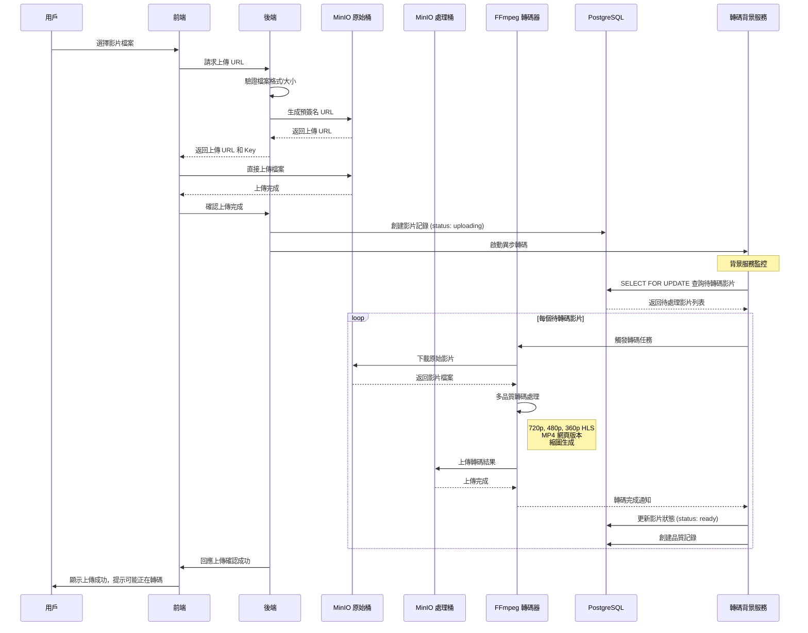
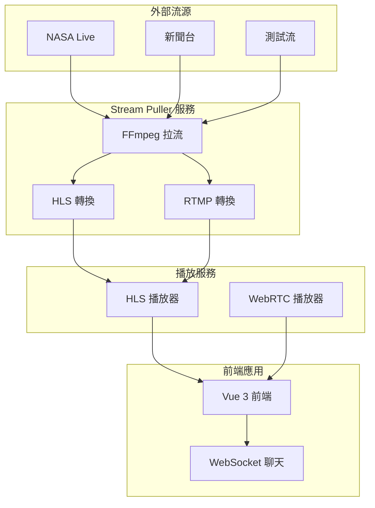
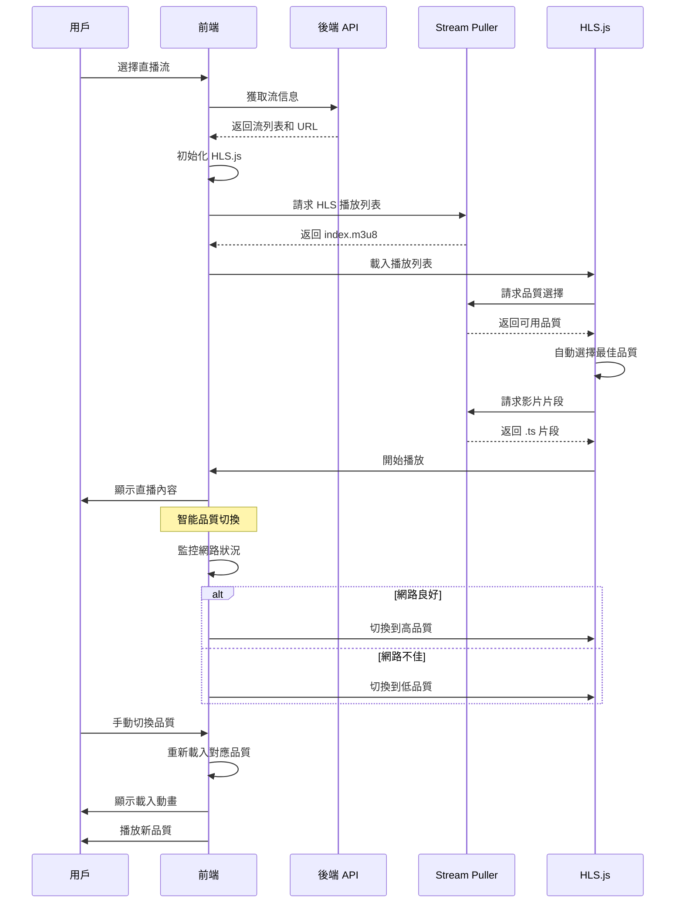

# 🎬 串流平台專案

## 📋 專案概述

現代化全棧串流平台，提供影片上傳、自動轉碼、直播和用戶管理功能。採用 **PostgreSQL + Redis 混合架構**，整合 **MinIO 對象存儲** 和 **FFmpeg 本地轉碼**。

### 🎯 核心特色
- ✅ **混合架構**: PostgreSQL 主資料庫 + Redis 緩存與訊息
- ✅ **智能轉碼**: 背景服務自動生成多品質 HLS 和 MP4
- ✅ **雙桶存儲**: 原始檔案與轉碼後檔案分離
- ✅ **直播系統**: 外部流拉取 + 低延遲播放
- ✅ **即時通信**: WebSocket + Redis Pub/Sub
- ✅ **現代前端**: Vue 3 + TypeScript + Element Plus
- ✅ **完整 Docker**: 一鍵啟動開發環境
- ✅ **模組化架構**: 依賴注入 + 統一路由管理

## 🏗️ 技術架構

```
前端 (Vue 3) → 後端 (Go/Gin) → 資料庫 (PostgreSQL + Redis) → 存儲 (MinIO) → 轉碼 (FFmpeg)
```

### 技術棧
- **前端**: Vue 3, TypeScript, Element Plus, hls.js
- **後端**: Go 1.24.3, Gin, GORM, JWT, 依賴注入
- **資料庫**: PostgreSQL 15, Redis 7, MySQL 8.0
- **存儲**: MinIO (S3 兼容)
- **轉碼**: FFmpeg 6.0.1
- **容器**: Docker & Docker Compose

## 🏛️ 後端架構設計

### 模組化架構
```
backend/
├── main.go (簡化入口)
├── api/ (統一 API 層)
│   ├── router.go (路由管理器)
│   ├── user.go, video.go, live.go, payment.go
│   └── public_stream.go
├── di/ (依賴注入)
│   └── container.go (依賴管理容器)
├── services/ (業務邏輯層)
├── database/ (資料庫層)
├── repositories/ (資料訪問層)
├── dto/ (資料傳輸對象)
├── middleware/ (中間件)
├── utils/ (工具函數)
├── pkg/ (公共包)
├── config/ (配置管理)
├── ws/ (WebSocket)
└── tests/ (測試)
```

### 設計模式
- **組合模式**: Router 組合所有 Handler
- **工廠模式**: Container 工廠創建服務實例
- **依賴注入**: 統一管理所有依賴關係

## 📈 核心服務流程

### 影片上傳與自動轉檔流程


### 直播流系統架構


### 前端智能播放流程


### 檔案存儲結構
```
MinIO Bucket: stream-demo-videos/ (原始檔案)
├── videos/
│   └── original/              # 原始上傳檔案
│       └── {user_id}/
│           └── {uuid}.{ext}   # 例：431254c8-6bdc-4137-969b-5fa3d9ae9788.mov

MinIO Bucket: stream-demo-processed/ (轉碼後檔案)
├── videos/
│   └── processed/             # 轉碼後檔案
│       └── {user_id}/
│           └── {video_id}/
│               ├── video.mp4                    # MP4 播放版本
│               ├── hls/                        # HLS 串流
│               │   ├── index.m3u8              # 主播放列表
│               │   ├── 720p/
│               │   │   ├── index.m3u8
│               │   │   └── segment_*.ts
│               │   ├── 480p/
│               │   │   ├── index.m3u8
│               │   │   └── segment_*.ts
│               │   └── 360p/
│               │       ├── index.m3u8
│               │       └── segment_*.ts
│               ├── thumbnails/                 # 縮圖
│               │   ├── thumb_320x240.jpg
│               │   ├── thumb_640x480.jpg
│               │   ├── thumb_1280x720.jpg
│               │   └── timeline_*.jpg          # 時間軸縮圖
│               └── transcode_report.json       # 轉碼報告
```

## 🚀 快速開始

### 環境要求
- Docker & Docker Compose
- Go 1.24.3+
- Node.js 18+

### 啟動開發環境

```bash
# 克隆專案
git clone <repository-url>
cd stream-demo

# 啟動所有服務
docker-compose up -d

# 檢查服務狀態
docker-compose ps
```

### 服務端口

| 服務 | 端口 | 描述 |
|------|------|------|
| PostgreSQL | 5432 | 主資料庫 |
| Redis | 6379 | 緩存與訊息 |
| MinIO API | 9000 | S3 兼容 API |
| MinIO Console | 9001 | 管理界面 |
| Go 後端 | 8080 | REST API |
| Vue 前端 | 5173 | 開發伺服器 |
| Stream Puller | 8083 | HLS 播放服務 |

### 初始設置

```bash
# MinIO 管理界面
http://localhost:9001
# 帳號: minioadmin / minioadmin

# 創建儲存桶
docker exec stream-demo-minio mc alias set local http://localhost:9000 minioadmin minioadmin
docker exec stream-demo-minio mc mb local/stream-demo-videos
docker exec stream-demo-minio mc mb local/stream-demo-processed
```

## 📊 功能完成度

### ✅ 已完成 (95%)
- **用戶認證**: 註冊、登入、JWT
- **影片系統**: 上傳、轉碼、播放
- **直播系統**: 流拉取、播放、狀態管理
- **技術架構**: API、前端、資料庫、Docker
- **架構重構**: 依賴注入、統一路由、模組化設計

### 🔄 進行中 (3%)
- **WebRTC 真實播放**: 需要信令服務器

### 📋 待開發 (2%)
- **直播間功能**: 實時聊天、觀眾互動
- **推流功能**: OBS/手機推流支援
- **支付系統**: 第三方支付整合
- **管理後台**: 系統管理界面

## 🎮 使用指南

### 影片上傳
1. 登入系統
2. 進入影片上傳頁面
3. 選擇檔案上傳
4. 系統自動轉碼 (背景處理)
5. 轉碼完成後可播放

### 直播觀看
1. 訪問公開流列表
2. 選擇直播流
3. 支援 HLS 播放 (2-5秒延遲)
4. 預留 WebRTC 播放 (超低延遲)

### 開發調試
```bash
# 查看轉碼日誌
docker logs stream-demo-transcoder

# 查看後端日誌 (控制台輸出)
cd backend && go run main.go

# 手動測試轉碼
docker exec stream-demo-transcoder /scripts/transcode.sh \
  "videos/original/1/test.mov" \
  "videos/processed/1/1" \
  "1" \
  "1"
```

## 🛠️ 開發指南

### 專案結構
```
stream-demo/
├── backend/          # Go 後端服務 (重構完成)
├── frontend/         # Vue 3 前端應用
├── docker/           # Docker 配置
├── docker-compose.yml # 服務編排
└── README.md         # 專案文檔
```

### 開發流程
1. 修改後端代碼 → `go run main.go`
2. 修改前端代碼 → `npm run dev`
3. 資料庫變更 → 執行遷移
4. 測試功能 → 使用 Docker 環境

## 📋 TODO 清單

### 高優先級
- [ ] **直播間功能**: 實時聊天、觀眾互動、禮物系統
- [ ] **WebRTC 信令服務器**: 實現真正的 WebRTC 播放
- [ ] **推流功能**: 支援 OBS 和手機推流

### 中優先級
- [ ] **直播錄製功能**: 將直播流存檔為 VOD
- [ ] **多品質直播**: 支援不同品質的直播流
- [ ] **彈幕系統**: 實時彈幕顯示

### 低優先級
- [ ] **支付系統**: 第三方支付整合
- [ ] **管理後台**: 系統管理界面
- [ ] **數據分析**: 用戶行為分析

## 🚀 微服務準備

專案已為微服務架構做好準備：

1. **前端服務 (Vue)** - `frontend/` ✅
2. **資料庫服務** - `database/` ✅
3. **記憶體儲存服務 (Redis)** - 通過配置管理 ✅
4. **後端平台服務 (Golang)** - `backend/` ✅ (已重構)
5. **直播拉流服務 (stream-puller)** - `cmd/stream_puller/` ✅
6. **影片儲存轉檔服務** - 可配置為 AWS S3 ✅

---

**下一步**: 開始開發直播間功能！🎉