# 🎬 串流平台專案完整技術文檔

## 📋 專案概述

這是一個現代化的全棧串流平台專案，提供完整的影片上傳、直播、用戶管理和支付功能。專案已從傳統的 MySQL + Redis + RabbitMQ 架構成功遷移到純 PostgreSQL 解決方案，實現了架構簡化和運維成本降低。

### 🎯 專案核心特色
- ✅ **純 PostgreSQL 架構**：使用 PostgreSQL 作為主資料庫、緩存和訊息佇列
- ✅ **雲端原生**：整合 AWS S3 和 MediaConvert 服務
- ✅ **實時通信**：WebSocket 即時聊天和直播互動
- ✅ **現代化前端**：Vue 3 + TypeScript + Element Plus
- ✅ **微服務準備**：清晰的分層架構和服務劃分

## 🏗️ 系統架構

### 整體架構圖
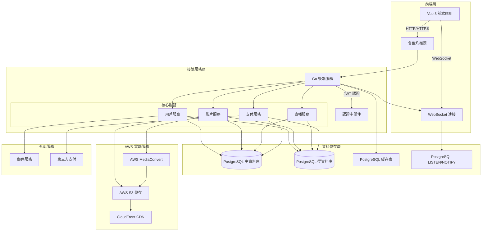

### 技術棧詳細說明

#### 前端技術棧
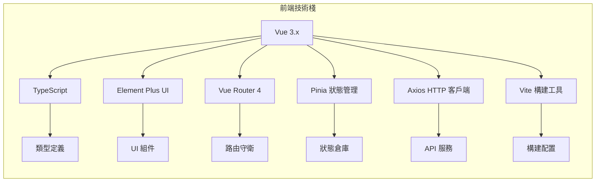

#### 後端技術棧
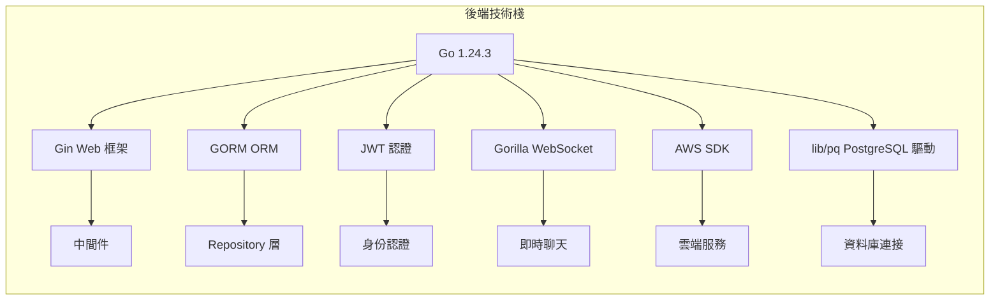

## 📊 資料庫設計

### PostgreSQL 架構圖
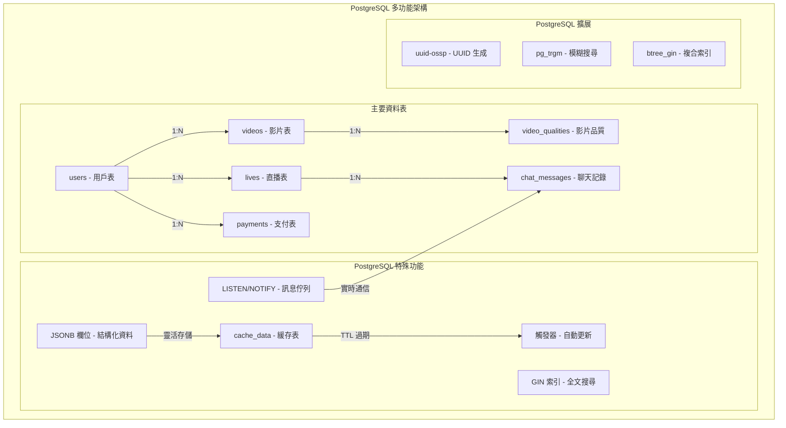

### 核心資料表結構

#### 1. 用戶表 (users)
```sql
CREATE TABLE users (
    id SERIAL PRIMARY KEY,
    username VARCHAR(50) UNIQUE NOT NULL,
    email VARCHAR(255) UNIQUE NOT NULL,
    password VARCHAR(255) NOT NULL,
    avatar VARCHAR(500),
    bio TEXT,
    role VARCHAR(20) DEFAULT 'user',
    is_active BOOLEAN DEFAULT true,
    created_at TIMESTAMP DEFAULT CURRENT_TIMESTAMP,
    updated_at TIMESTAMP DEFAULT CURRENT_TIMESTAMP
);
```

#### 2. 影片表 (videos)
```sql
CREATE TABLE videos (
    id SERIAL PRIMARY KEY,
    title VARCHAR(100) NOT NULL,
    description TEXT,
    user_id INTEGER REFERENCES users(id) ON DELETE CASCADE,
    original_url VARCHAR(500) NOT NULL,
    original_key VARCHAR(500),
    thumbnail_url VARCHAR(500),
    hls_master_url VARCHAR(500),
    hls_key VARCHAR(500),
    duration INTEGER DEFAULT 0,
    file_size BIGINT DEFAULT 0,
    original_format VARCHAR(10),
    status VARCHAR(20) NOT NULL,
    processing_progress INTEGER DEFAULT 0,
    error_message VARCHAR(500),
    views BIGINT DEFAULT 0,
    likes BIGINT DEFAULT 0,
    created_at TIMESTAMP DEFAULT CURRENT_TIMESTAMP,
    updated_at TIMESTAMP DEFAULT CURRENT_TIMESTAMP
);

-- 創建索引
CREATE INDEX idx_videos_user_status ON videos(user_id, status);
CREATE INDEX idx_videos_status_created ON videos(status, created_at);
CREATE INDEX idx_videos_user_created ON videos(user_id, created_at);
```

#### 3. 直播表 (lives)
```sql
CREATE TABLE lives (
    id SERIAL PRIMARY KEY,
    title VARCHAR(100) NOT NULL,
    description TEXT,
    user_id INTEGER REFERENCES users(id) ON DELETE CASCADE,
    status VARCHAR(20) NOT NULL,
    start_time TIMESTAMP,
    end_time TIMESTAMP,
    stream_key VARCHAR(100) UNIQUE,
    viewer_count BIGINT DEFAULT 0,
    chat_enabled BOOLEAN DEFAULT true,
    created_at TIMESTAMP DEFAULT CURRENT_TIMESTAMP,
    updated_at TIMESTAMP DEFAULT CURRENT_TIMESTAMP
);

-- 創建索引
CREATE INDEX idx_lives_user_status ON lives(user_id, status);
CREATE INDEX idx_lives_status_start ON lives(status, start_time);
```

#### 4. PostgreSQL 緩存表 (cache_data)
```sql
CREATE TABLE cache_data (
    key VARCHAR(255) PRIMARY KEY,
    value JSONB NOT NULL,
    expires_at TIMESTAMP,
    created_at TIMESTAMP DEFAULT CURRENT_TIMESTAMP,
    updated_at TIMESTAMP DEFAULT CURRENT_TIMESTAMP
);

-- 創建過期清理觸發器
CREATE OR REPLACE FUNCTION cleanup_expired_cache()
RETURNS TRIGGER AS $$
BEGIN
    DELETE FROM cache_data WHERE expires_at < CURRENT_TIMESTAMP;
    RETURN NULL;
END;
$$ LANGUAGE plpgsql;

CREATE TRIGGER cleanup_cache_trigger
    AFTER INSERT OR UPDATE ON cache_data
    EXECUTE FUNCTION cleanup_expired_cache();
```

## 🔧 功能模組地圖

### 功能架構圖
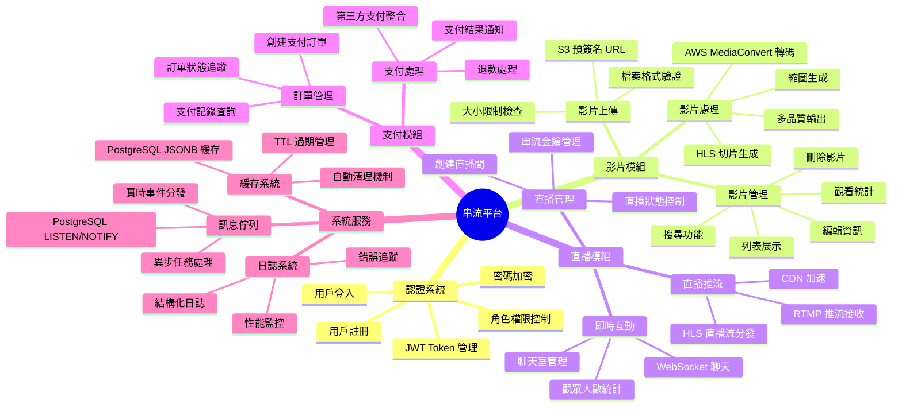

## 🎨 前端頁面地圖

### 前端路由架構
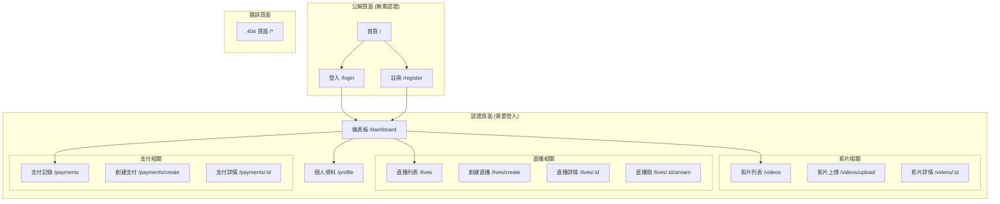

### 前端組件架構
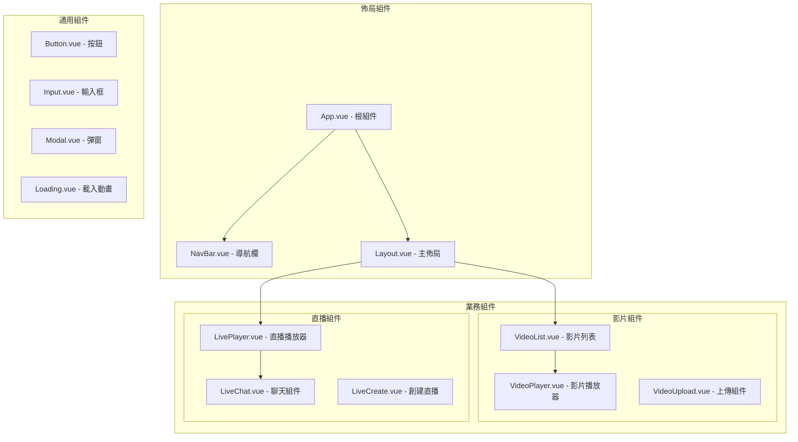

## 📈 業務流程圖

### 影片上傳處理流程
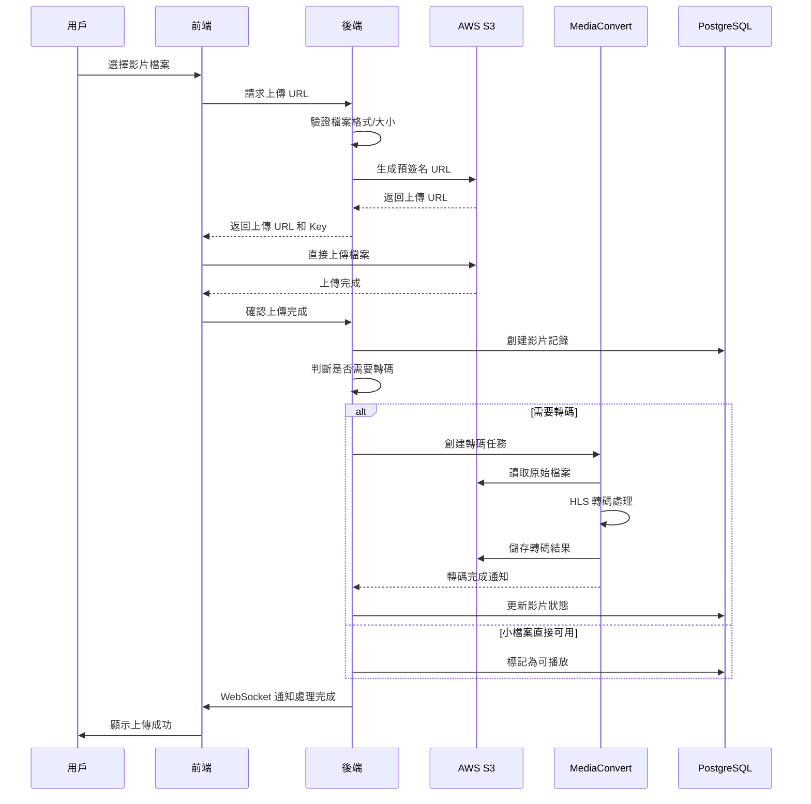

### 直播聊天流程
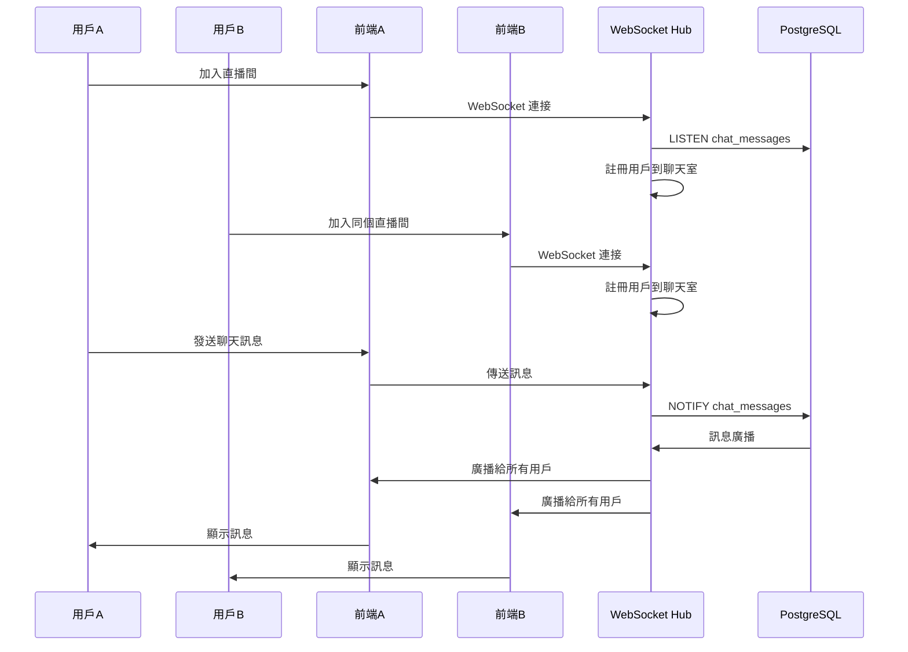

### 用戶認證流程
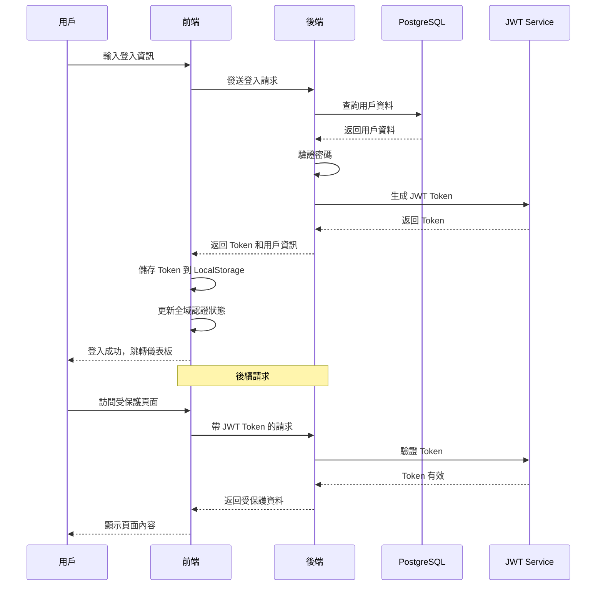

## 🛠️ 部署架構

### Docker 容器部署
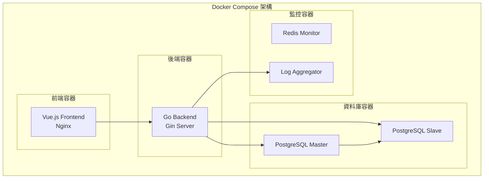

### 雲端部署架構
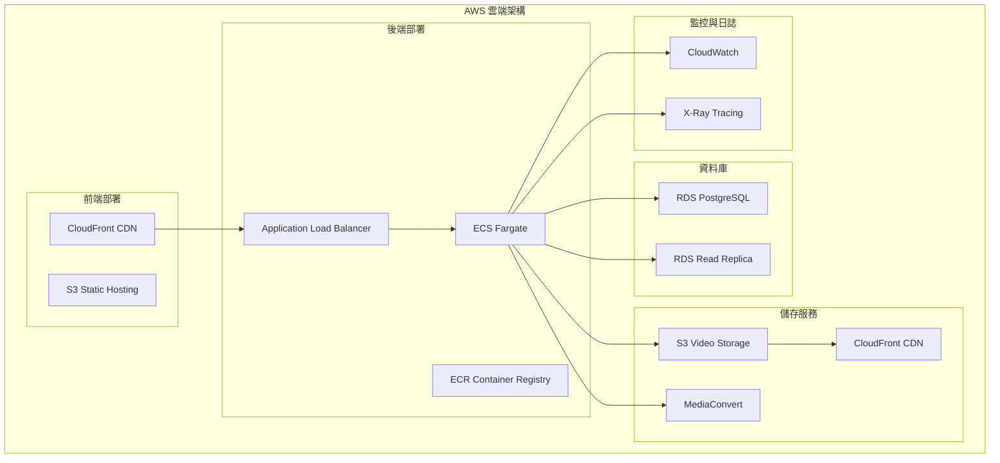

## 🔧 開發環境設定

### 必要軟體安裝

#### 1. 後端開發環境
```bash
# 安裝 Go 1.24.3+
# macOS
brew install go

# Ubuntu/Debian
sudo apt update
sudo apt install golang-go

# 驗證安裝
go version

# 安裝 PostgreSQL
# macOS
brew install postgresql
brew services start postgresql

# Ubuntu/Debian
sudo apt install postgresql postgresql-contrib
sudo systemctl start postgresql
sudo systemctl enable postgresql
```

#### 2. 前端開發環境
```bash
# 安裝 Node.js 18+
# macOS
brew install node

# Ubuntu/Debian
curl -fsSL https://deb.nodesource.com/setup_18.x | sudo -E bash -
sudo apt-get install -y nodejs

# 驗證安裝
node --version
npm --version

# 安裝全域工具
npm install -g @vue/cli
npm install -g vite
```

### 專案初始化

#### 1. 後端設定
```bash
# 進入後端目錄
cd backend

# 安裝依賴
go mod tidy

# 創建 PostgreSQL 資料庫
psql -U postgres
CREATE DATABASE stream_demo;
CREATE USER stream_user WITH ENCRYPTED PASSWORD 'stream_password';
GRANT ALL PRIVILEGES ON DATABASE stream_demo TO stream_user;
\q

# 複製配置檔案
cp config/config.local.yaml.example config/config.local.yaml

# 編輯配置檔案 (填入實際的 AWS 憑證)
nano config/config.local.yaml

# 執行資料庫遷移
go run main.go migrate

# 啟動開發伺服器
go run main.go
```

#### 2. 前端設定
```bash
# 進入前端目錄
cd frontend

# 安裝依賴
npm install

# 啟動開發伺服器
npm run dev

# 構建生產版本
npm run build

# 預覽生產版本
npm run preview
```

#### 3. Docker 開發環境
```bash
# 根目錄創建 docker-compose.yml
touch docker-compose.yml

# 啟動所有服務
docker-compose up -d

# 查看日誌
docker-compose logs -f

# 停止所有服務
docker-compose down
```

## ☁️ AWS 服務配置需求

### 必要的 AWS 服務

#### 1. S3 儲存服務設定
```bash
# 創建 S3 Bucket
aws s3 mb s3://stream-demo-videos --region ap-northeast-1
aws s3 mb s3://stream-demo-processed --region ap-northeast-1

# 設定 CORS 政策
aws s3api put-bucket-cors --bucket stream-demo-videos --cors-configuration file://s3-cors.json

# s3-cors.json 內容：
{
  "CORSRules": [
    {
      "AllowedOrigins": ["*"],
      "AllowedMethods": ["GET", "PUT", "POST", "DELETE"],
      "AllowedHeaders": ["*"],
      "ExposeHeaders": ["ETag"],
      "MaxAgeSeconds": 3000
    }
  ]
}

# 設定生命週期政策 (自動清理臨時檔案)
aws s3api put-bucket-lifecycle-configuration --bucket stream-demo-videos --lifecycle-configuration file://s3-lifecycle.json
```

#### 2. CloudFront CDN 設定
```bash
# 創建 CloudFront 分發
aws cloudfront create-distribution --distribution-config file://cloudfront-config.json

# cloudfront-config.json 重要設定：
{
  "CallerReference": "stream-demo-2024",
  "Origins": {
    "Quantity": 1,
    "Items": [
      {
        "Id": "S3-stream-demo-videos",
        "DomainName": "stream-demo-videos.s3.ap-northeast-1.amazonaws.com",
        "S3OriginConfig": {
          "OriginAccessIdentity": ""
        }
      }
    ]
  },
  "DefaultCacheBehavior": {
    "TargetOriginId": "S3-stream-demo-videos",
    "ViewerProtocolPolicy": "redirect-to-https",
    "Compress": true
  }
}
```

#### 3. MediaConvert 設定
```bash
# 創建 MediaConvert 服務角色
aws iam create-role --role-name MediaConvertRole --assume-role-policy-document file://mediaconvert-trust-policy.json

# mediaconvert-trust-policy.json：
{
  "Version": "2012-10-17",
  "Statement": [
    {
      "Effect": "Allow",
      "Principal": {
        "Service": "mediaconvert.amazonaws.com"
      },
      "Action": "sts:AssumeRole"
    }
  ]
}

# 附加必要權限
aws iam attach-role-policy --role-name MediaConvertRole --policy-arn arn:aws:iam::aws:policy/AmazonS3FullAccess

# 獲取 MediaConvert 端點
aws mediaconvert describe-endpoints --region ap-northeast-1
```

#### 4. IAM 權限設定
```json
{
  "Version": "2012-10-17",
  "Statement": [
    {
      "Effect": "Allow",
      "Action": [
        "s3:GetObject",
        "s3:PutObject",
        "s3:DeleteObject",
        "s3:ListBucket"
      ],
      "Resource": [
        "arn:aws:s3:::stream-demo-videos/*",
        "arn:aws:s3:::stream-demo-processed/*"
      ]
    },
    {
      "Effect": "Allow",
      "Action": [
        "mediaconvert:CreateJob",
        "mediaconvert:GetJob",
        "mediaconvert:ListJobs"
      ],
      "Resource": "*"
    }
  ]
}
```

### AWS 成本估算

#### 月費用估算 (基於中等使用量)
- **S3 儲存**: ~$50-100 (1TB 影片儲存)
- **CloudFront**: ~$30-80 (100GB 流量)
- **MediaConvert**: ~$20-60 (100小時轉碼)
- **RDS PostgreSQL**: ~$100-200 (db.r5.large)
- **ECS Fargate**: ~$80-150 (2vCPU, 4GB RAM)
- **總計**: ~$280-590/月

## 📊 效能監控與最佳化

### 監控指標
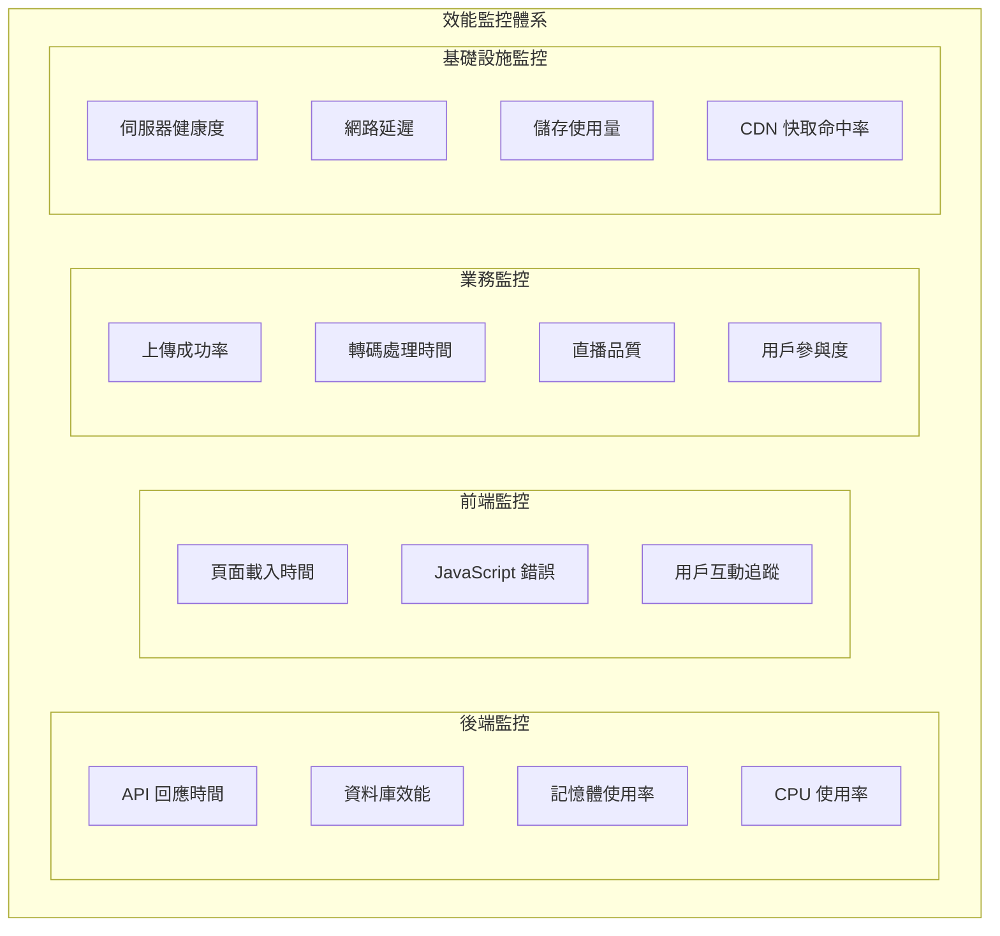

### PostgreSQL 效能最佳化

#### 索引最佳化
```sql
-- 影片搜尋全文索引
CREATE INDEX idx_videos_fulltext ON videos 
USING gin(to_tsvector('english', title || ' ' || COALESCE(description, '')));

-- 用戶活動複合索引
CREATE INDEX idx_videos_user_activity ON videos(user_id, status, created_at DESC);

-- 直播狀態索引
CREATE INDEX idx_lives_active ON lives(status, start_time) 
WHERE status IN ('live', 'scheduled');

-- 緩存查詢索引
CREATE INDEX idx_cache_lookup ON cache_data(key, expires_at) 
WHERE expires_at > CURRENT_TIMESTAMP;
```

#### 連接池配置
```yaml
# config/config.local.yaml
database:
  pool:
    max_open_conns: 25      # 最大連接數
    max_idle_conns: 10      # 最大空閒連接數
    conn_max_lifetime: 3600 # 連接最大生存時間（秒）
    conn_max_idle_time: 900 # 連接最大空閒時間（秒）
```

## 🚀 部署指南

### 生產環境部署檢查清單

#### 安全性檢查
- [ ] JWT 金鑰使用強隨機值
- [ ] 資料庫密碼使用強密碼
- [ ] AWS 憑證使用 IAM 角色（不硬編碼）
- [ ] HTTPS 證書配置正確
- [ ] CORS 政策限制適當的域名
- [ ] 敏感資料使用環境變數

#### 效能檢查
- [ ] 資料庫索引已創建
- [ ] CDN 配置已啟用
- [ ] 圖片和影片壓縮已啟用
- [ ] 快取策略已實施
- [ ] 連接池配置已最佳化

#### 監控檢查
- [ ] 健康檢查端點可用
- [ ] 日誌系統正常運作
- [ ] 錯誤追蹤已設定
- [ ] 效能監控已啟用
- [ ] 警報通知已配置

### Docker Compose 生產配置

```yaml
# docker-compose.prod.yml
version: '3.8'

services:
  frontend:
    build:
      context: ./frontend
      dockerfile: Dockerfile.prod
    ports:
      - "80:80"
      - "443:443"
    volumes:
      - ./nginx/nginx.conf:/etc/nginx/nginx.conf
      - ./ssl:/etc/ssl/certs
    depends_on:
      - backend

  backend:
    build:
      context: ./backend
      dockerfile: Dockerfile.prod
    ports:
      - "8080:8080"
    environment:
      - GIN_MODE=release
      - DB_HOST=postgres
      - AWS_REGION=ap-northeast-1
    volumes:
      - ./config:/app/config
      - ./logs:/app/logs
    depends_on:
      - postgres

  postgres:
    image: postgres:15-alpine
    environment:
      - POSTGRES_DB=stream_demo
      - POSTGRES_USER=stream_user
      - POSTGRES_PASSWORD=${POSTGRES_PASSWORD}
    volumes:
      - postgres_data:/var/lib/postgresql/data
      - ./postgres/init.sql:/docker-entrypoint-initdb.d/init.sql
    ports:
      - "5432:5432"

  redis_monitor:
    image: redis:7-alpine
    ports:
      - "6379:6379"
    command: redis-server --appendonly yes
    volumes:
      - redis_data:/data

volumes:
  postgres_data:
  redis_data:
```

## 🔄 未來規劃與擴展

### 短期目標 (1-3個月)
- [ ] **效能最佳化**
  - PostgreSQL 查詢最佳化
  - 前端代碼分割和懶載入
  - CDN 快取策略優化
  
- [ ] **功能增強**
  - 影片評論系統
  - 用戶關注/訂閱功能
  - 直播預約通知
  - 支付系統完善

- [ ] **監控改進**
  - APM 工具整合
  - 錯誤追蹤系統
  - 使用者行為分析

### 中期目標 (3-6個月)
- [ ] **微服務架構**
  - 服務拆分規劃
  - API Gateway 實作
  - 服務間通信機制
  
- [ ] **容器化部署**
  - Kubernetes 部署
  - 自動擴縮容
  - 零停機部署

- [ ] **國際化支援**
  - 多語言介面
  - 時區處理
  - 地區化內容

### 長期目標 (6-12個月)
- [ ] **AI 功能整合**
  - 智能推薦系統
  - 內容審核 AI
  - 自動字幕生成
  
- [ ] **移動端應用**
  - React Native 應用
  - 推播通知
  - 離線功能

- [ ] **高級分析**
  - 實時數據儀表板
  - 用戶留存分析
  - 收益最佳化

## 📝 開發團隊協作

### Git 工作流程
```mermaid
gitgraph
    commit id: "Initial commit"
    branch develop
    checkout develop
    commit id: "Setup project structure"
    
    branch feature/user-auth
    checkout feature/user-auth
    commit id: "Implement login"
    commit id: "Add JWT middleware"
    
    checkout develop
    merge feature/user-auth
    
    branch feature/video-upload
    checkout feature/video-upload
    commit id: "S3 integration"
    commit id: "MediaConvert setup"
    
    checkout develop
    merge feature/video-upload
    
    checkout main
    merge develop
    commit id: "Release v1.0.0"
```

### 代碼審查檢查清單
- [ ] 代碼符合專案編碼規範
- [ ] 新功能包含適當的測試
- [ ] 文檔已更新
- [ ] 安全性考量已處理
- [ ] 效能影響已評估
- [ ] 錯誤處理已實作

## 🎯 快速開始指令

### 本地開發環境一鍵啟動
```bash
#!/bin/bash
# start-dev.sh

echo "🚀 啟動串流平台開發環境..."

# 檢查必要軟體
command -v go >/dev/null 2>&1 || { echo "請先安裝 Go"; exit 1; }
command -v node >/dev/null 2>&1 || { echo "請先安裝 Node.js"; exit 1; }
command -v psql >/dev/null 2>&1 || { echo "請先安裝 PostgreSQL"; exit 1; }

# 啟動 PostgreSQL (如果未啟動)
if ! pgrep -x "postgres" > /dev/null; then
    echo "啟動 PostgreSQL..."
    brew services start postgresql  # macOS
    # sudo systemctl start postgresql  # Linux
fi

# 後端設定
echo "📊 設定後端..."
cd backend
if [ ! -f "config/config.local.yaml" ]; then
    cp config/config.local.yaml.example config/config.local.yaml
    echo "⚠️  請編輯 config/config.local.yaml 填入 AWS 憑證"
fi

# 安裝後端依賴
go mod tidy

# 執行資料庫遷移
echo "🗄️ 執行資料庫遷移..."
go run main.go migrate

# 啟動後端伺服器
echo "🔧 啟動後端伺服器..."
go run main.go &
BACKEND_PID=$!

# 前端設定
echo "🎨 設定前端..."
cd ../frontend

# 安裝前端依賴
if [ ! -d "node_modules" ]; then
    npm install
fi

# 啟動前端開發伺服器
echo "🚀 啟動前端開發伺服器..."
npm run dev &
FRONTEND_PID=$!

echo "✅ 開發環境啟動完成！"
echo "📱 前端: http://localhost:5173"
echo "🔧 後端: http://localhost:8080"
echo "📊 健康檢查: http://localhost:8080/health"
echo ""
echo "按 Ctrl+C 停止所有服務"

# 等待中斷信號
trap "kill $BACKEND_PID $FRONTEND_PID; exit" INT
wait
```

---

## 📞 聯絡資訊

- **專案維護者**: 開發團隊
- **技術支援**: tech-support@stream-demo.com
- **文檔版本**: v1.0.0
- **最後更新**: 2024-12-19

---

*這份文檔涵蓋了串流平台專案的完整技術實作，包含架構設計、開發指南、部署流程和未來規劃。如有任何問題或建議，請參考聯絡資訊或提交 Issue。* 