# 🎬 串流平台專案完整技術文檔

## 📋 專案概述

這是一個現代化的全棧串流平台專案，提供完整的影片上傳、自動轉檔、直播、用戶管理和支付功能。專案採用 **PostgreSQL + Redis 混合架構**，結合 **MinIO 對象存儲** 和 **FFmpeg 本地轉碼服務**，實現高效能的影片處理和播放體驗。

### 🎯 專案核心特色
- ✅ **混合架構設計**：PostgreSQL 作為主資料庫，Redis 作為緩存和訊息佇列
- ✅ **本地化存儲與轉碼**：整合 MinIO S3 兼容對象存儲和 FFmpeg 本地轉碼服務
- ✅ **智能自動轉碼系統**：背景服務自動處理上傳影片，生成多品質 HLS 串流和 MP4 播放版本
- ✅ **雙桶存儲架構**：原始檔案存儲於 `stream-demo-videos`，轉碼後檔案存儲於 `stream-demo-processed`
- ✅ **實時通信**：Redis Pub/Sub + WebSocket 即時聊天和直播互動
- ✅ **現代化前端**：Vue 3 + TypeScript + Element Plus + hls.js
- ✅ **智能播放體驗**：自動品質切換、垂直影片比例保持、即時載入
- ✅ **完整 Docker 化**：包含 FFmpeg 轉碼容器的完整開發環境

## 🏗️ 系統架構

### 整體架構圖
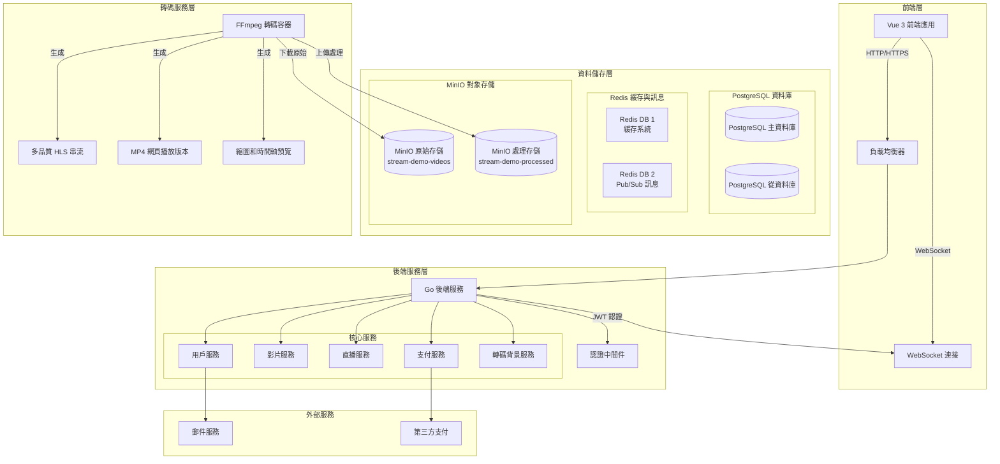

### 技術棧詳細說明

#### 前端技術棧
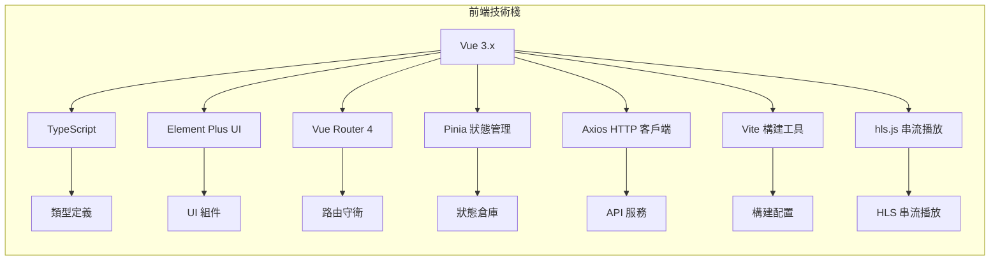

#### 後端技術棧
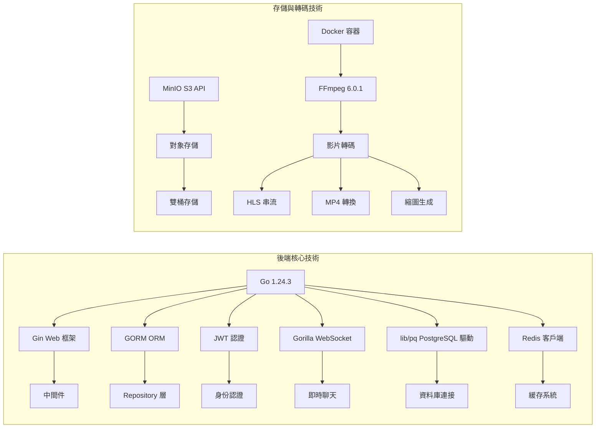

## ⚡ 技術架構評估與實現

### PostgreSQL + Redis 混合架構設計

本專案採用 **PostgreSQL + Redis 混合架構**，結合兩者優勢實現最佳化的效能：

#### Redis 緩存與訊息系統的性能特點
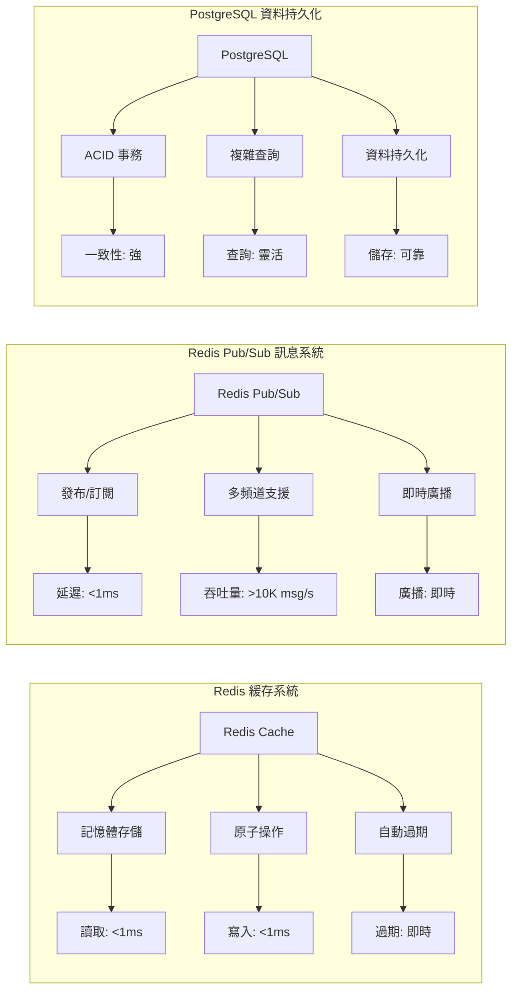

#### Redis 架構優勢分析

**Redis 緩存優勢:**
- ✅ 極低延遲（<1ms）
- ✅ 高吞吐量（>100K ops/s）
- ✅ 記憶體存儲，高速存取
- ✅ 豐富的資料結構支援
- ✅ 自動過期機制

**Redis Pub/Sub 優勢:**
- ✅ 即時訊息傳遞（<1ms 延遲）
- ✅ 高並發訊息處理
- ✅ 多頻道隔離
- ✅ 水平擴展支援
- ✅ 跨實例通信簡單

#### 實現的混合架構

本專案實現的架構充分利用兩種技術的優勢：

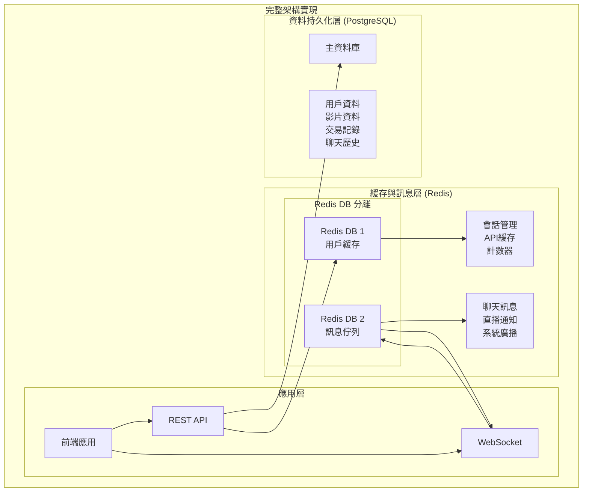

#### 架構實現特色

1. **資料庫隔離**
   - Redis DB 1: 緩存資料
   - Redis DB 2: 訊息佇列
   - PostgreSQL: 持久化資料

2. **智能緩存策略**
   - 會話資料：Redis 緩存（快速驗證）
   - 用戶資料：Redis + PostgreSQL（讀寫分離）
   - 即時計數：Redis 原子操作

3. **即時通信系統**
   - 聊天訊息：Redis Pub/Sub 即時廣播
   - 直播通知：多頻道隔離
   - 系統訊息：統一發布機制

#### 效能提升對比

| 功能 | 純 PostgreSQL | PostgreSQL + Redis | 提升幅度 |
|------|---------------|-------------------|----------|
| 緩存讀取 | 5-50ms | <1ms | **50-500倍** |
| 聊天延遲 | 10-100ms | <1ms | **10-100倍** |
| 訊息吞吐 | 1K-5K msg/s | >10K msg/s | **2-10倍** |
| 會話驗證 | 每次查詢DB | 記憶體驗證 | **100-1000倍** |

## 📊 資料庫設計

### PostgreSQL + Redis 架構圖
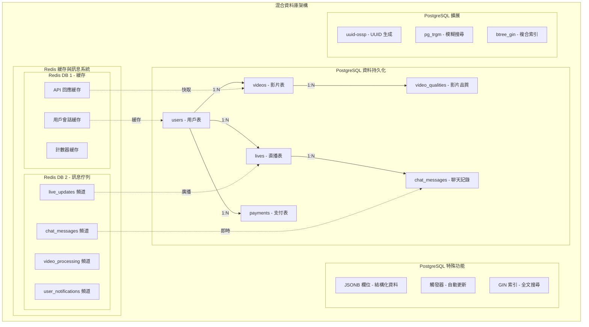

### 核心資料表結構

#### 1. 用戶表 (users)
```sql
CREATE TABLE users (
    id SERIAL PRIMARY KEY,
    username VARCHAR(50) UNIQUE NOT NULL,
    email VARCHAR(255) UNIQUE NOT NULL,
    password VARCHAR(255) NOT NULL,
    avatar VARCHAR(500),
    bio TEXT,
    role VARCHAR(20) DEFAULT 'user',
    is_active BOOLEAN DEFAULT true,
    created_at TIMESTAMP DEFAULT CURRENT_TIMESTAMP,
    updated_at TIMESTAMP DEFAULT CURRENT_TIMESTAMP
);
```

#### 2. 影片表 (videos)
```sql
CREATE TABLE videos (
    id SERIAL PRIMARY KEY,
    title VARCHAR(100) NOT NULL,
    description TEXT,
    user_id INTEGER REFERENCES users(id) ON DELETE CASCADE,
    
    -- 原始影片資訊
    original_url VARCHAR(500) NOT NULL,
    original_key VARCHAR(500),
    thumbnail_url VARCHAR(500),
    
    -- HLS 串流資訊
    hls_master_url VARCHAR(500),
    hls_key VARCHAR(500),
    
    -- MP4 轉碼版本
    mp4_url VARCHAR(500),
    mp4_key VARCHAR(500),
    
    -- 影片屬性
    duration INTEGER DEFAULT 0,
    file_size BIGINT DEFAULT 0,
    original_format VARCHAR(10),
    
    -- 狀態管理
    status VARCHAR(20) NOT NULL,  -- uploading, processing, transcoding, ready, failed
    processing_progress INTEGER DEFAULT 0,  -- 0-100
    error_message VARCHAR(500),
    
    -- 統計資料
    views BIGINT DEFAULT 0,
    likes BIGINT DEFAULT 0,
    created_at TIMESTAMP DEFAULT CURRENT_TIMESTAMP,
    updated_at TIMESTAMP DEFAULT CURRENT_TIMESTAMP
);

-- 創建索引
CREATE INDEX idx_videos_user_status ON videos(user_id, status);
CREATE INDEX idx_videos_status_created ON videos(status, created_at);
CREATE INDEX idx_videos_user_created ON videos(user_id, created_at);
```

#### 3. 影片品質表 (video_qualities)
```sql
CREATE TABLE video_qualities (
    id SERIAL PRIMARY KEY,
    video_id INTEGER REFERENCES videos(id) ON DELETE CASCADE,
    quality VARCHAR(10) NOT NULL,  -- 720p, 480p, 360p
    width INTEGER NOT NULL,
    height INTEGER NOT NULL,
    bitrate INTEGER NOT NULL,
    file_url VARCHAR(500) NOT NULL,
    file_size BIGINT DEFAULT 0,
    status VARCHAR(20) DEFAULT 'ready',
    created_at TIMESTAMP DEFAULT CURRENT_TIMESTAMP,
    updated_at TIMESTAMP DEFAULT CURRENT_TIMESTAMP
);

-- 創建索引
CREATE INDEX idx_video_qualities_video_id ON video_qualities(video_id);
CREATE INDEX idx_video_qualities_quality ON video_qualities(quality);
```

#### 4. 直播表 (lives)
```sql
CREATE TABLE lives (
    id SERIAL PRIMARY KEY,
    title VARCHAR(100) NOT NULL,
    description TEXT,
    user_id INTEGER REFERENCES users(id) ON DELETE CASCADE,
    status VARCHAR(20) NOT NULL,
    start_time TIMESTAMP,
    end_time TIMESTAMP,
    stream_key VARCHAR(100) UNIQUE,
    viewer_count BIGINT DEFAULT 0,
    chat_enabled BOOLEAN DEFAULT true,
    created_at TIMESTAMP DEFAULT CURRENT_TIMESTAMP,
    updated_at TIMESTAMP DEFAULT CURRENT_TIMESTAMP
);

-- 創建索引
CREATE INDEX idx_lives_user_status ON lives(user_id, status);
CREATE INDEX idx_lives_status_start ON lives(status, start_time);
```

#### 5. Redis 緩存配置

Redis 作為緩存和訊息系統，使用不同的資料庫來隔離功能：

```yaml
# config/config.local.yaml
redis:
  master:
    host: "localhost"
    port: 6379
    password: ""
    db: 0
  pool:
    max_active: 100
    max_idle: 20
    idle_timeout: 300

cache:
  type: "redis"
  db: 1                     # Redis DB 1 用於緩存
  key_prefix: "cache:"      # 緩存鍵前綴
  default_expiration: 3600  # 默認過期時間（秒）

messaging:
  type: "redis"
  db: 2                     # Redis DB 2 用於訊息佇列
  channels:
    - "video_processing"    # 影片處理通知
    - "live_updates"        # 直播更新通知
    - "user_notifications"  # 用戶通知
    - "chat_messages"       # 聊天訊息
```

## 🔧 功能模組地圖

### 功能架構圖
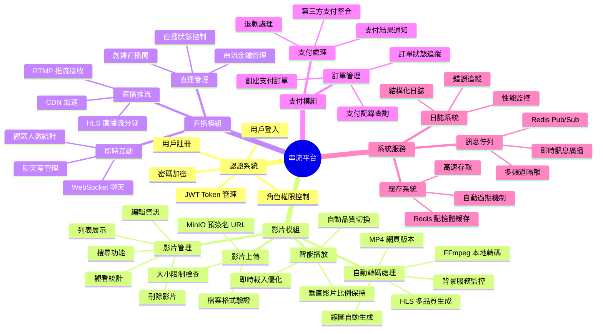

## 🎨 前端頁面地圖

### 前端路由架構
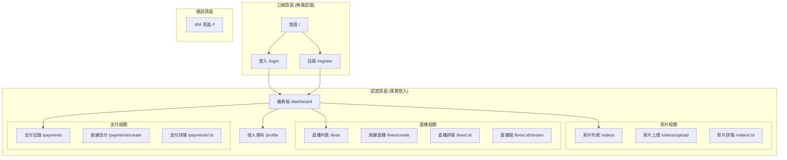

### 前端組件架構
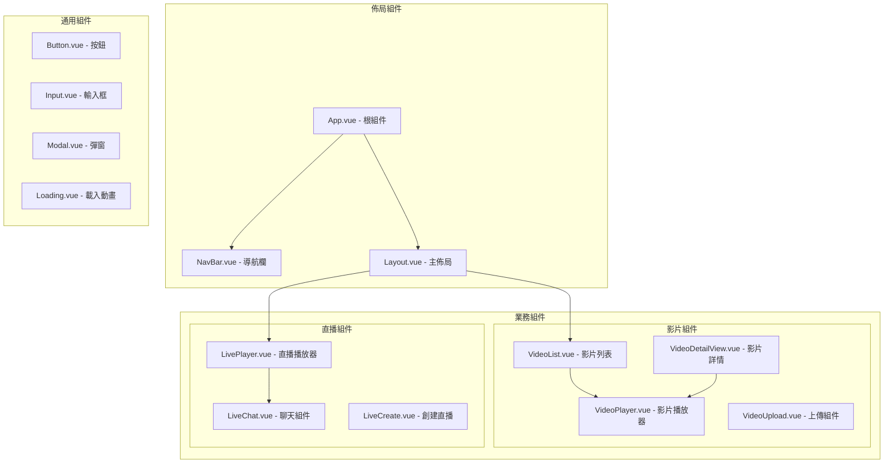

## 📈 業務流程圖

### 影片上傳與自動轉檔流程
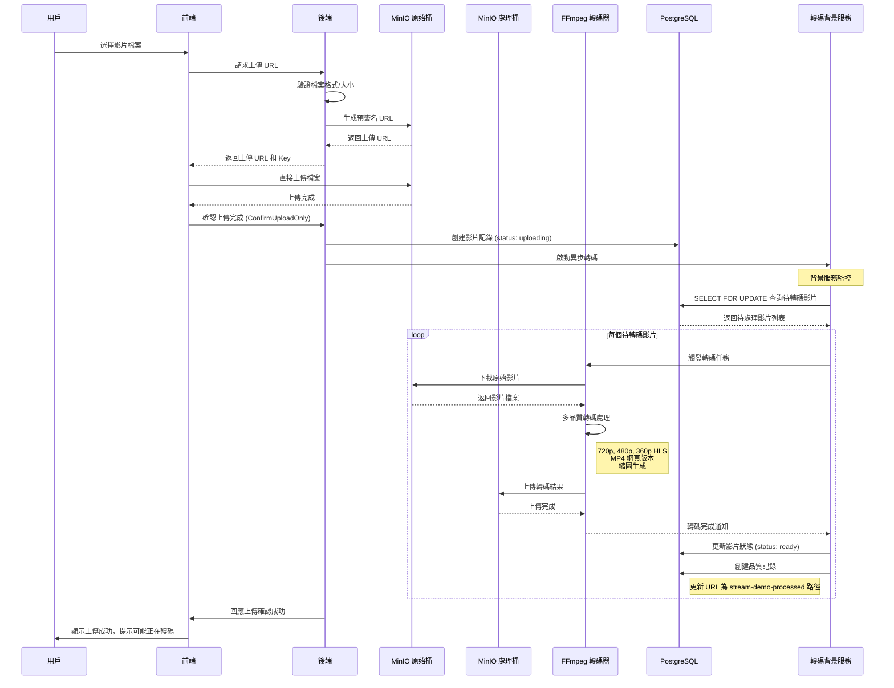

### 背景轉碼服務流程

```mermaid
sequenceDiagram
    participant TW as 轉碼背景服務
    participant DB as PostgreSQL
    participant FFMPEG as FFmpeg 容器
    participant MINIO_ORIG as MinIO 原始桶
    participant MINIO_PROC as MinIO 處理桶
    
    Note over TW: 服務啟動時自動檢查
    TW->>DB: 查詢待轉碼影片
    Note right of TW: SELECT FOR UPDATE<br/>status IN ('uploading', 'processing', 'transcoding')
    
    DB-->>TW: 返回待處理影片列表
    
    loop 每個影片
        TW->>TW: 驗證影片檔案存在性
        TW->>DB: 更新狀態為 'transcoding'
        
        TW->>FFMPEG: 觸發轉碼任務
        Note right of FFMPEG: 輸入: videos/original/{user_id}/{uuid}.{ext}<br/>輸出: videos/processed/{user_id}/{video_id}/
        
        FFMPEG->>MINIO_ORIG: 下載原始影片
        MINIO_ORIG-->>FFMPEG: 返回影片檔案
        
        FFMPEG->>FFMPEG: 分析影片資訊
        Note right of FFMPEG: 解析尺寸、時長、格式<br/>保持原始比例 (scale=width:-1)
        
        parallel 多格式轉碼
            FFMPEG->>FFMPEG: 生成 MP4 (H.264+AAC)
            and FFMPEG->>FFMPEG: 生成 HLS 720p
            and FFMPEG->>FFMPEG: 生成 HLS 480p  
            and FFMPEG->>FFMPEG: 生成 HLS 360p
            and FFMPEG->>FFMPEG: 生成縮圖 (多尺寸)
            and FFMPEG->>FFMPEG: 生成時間軸縮圖
        end
        
        FFMPEG->>MINIO_PROC: 上傳 MP4 版本
        FFMPEG->>MINIO_PROC: 上傳 HLS 串流檔案
        FFMPEG->>MINIO_PROC: 上傳縮圖檔案
        FFMPEG->>MINIO_PROC: 上傳轉碼報告
        
        FFMPEG-->>TW: 轉碼完成通知
        TW->>DB: 更新影片 URL 和狀態
        Note right of DB: MP4URL, HLSMasterURL<br/>ThumbnailURL, Status: ready<br/>所有 URL 指向 stream-demo-processed
        
        TW->>DB: 創建品質記錄
        Note right of DB: VideoQuality: 720p, 480p, 360p<br/>file_url 指向 stream-demo-processed
    end
    
    Note over TW: 每 30 秒重複檢查
```

### 前端智能播放流程

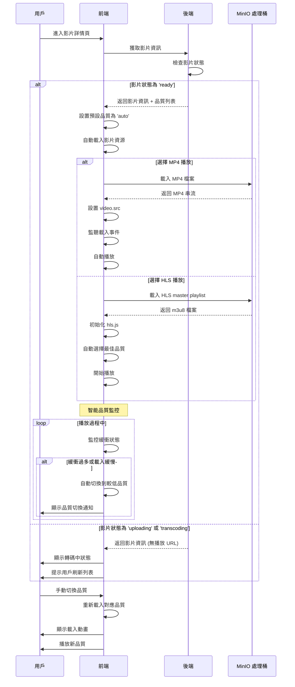

### 檔案存儲結構

```
MinIO Bucket: stream-demo-videos/ (原始檔案)
├── videos/
│   └── original/              # 原始上傳檔案
│       └── {user_id}/
│           └── {uuid}.{ext}   # 例：431254c8-6bdc-4137-969b-5fa3d9ae9788.mov

MinIO Bucket: stream-demo-processed/ (轉碼後檔案)
├── videos/
│   └── processed/             # 轉碼後檔案
│       └── {user_id}/
│           └── {video_id}/
│               ├── video.mp4                    # MP4 播放版本
│               ├── hls/                        # HLS 串流
│               │   ├── index.m3u8              # 主播放列表
│               │   ├── 720p/
│               │   │   ├── index.m3u8
│               │   │   └── segment_*.ts
│               │   ├── 480p/
│               │   │   ├── index.m3u8
│               │   │   └── segment_*.ts
│               │   └── 360p/
│               │       ├── index.m3u8
│               │       └── segment_*.ts
│               ├── thumbnails/                 # 縮圖
│               │   ├── thumb_320x240.jpg
│               │   ├── thumb_640x480.jpg
│               │   ├── thumb_1280x720.jpg
│               │   └── timeline_*.jpg          # 時間軸縮圖
│               └── transcode_report.json       # 轉碼報告
```

### 直播聊天流程
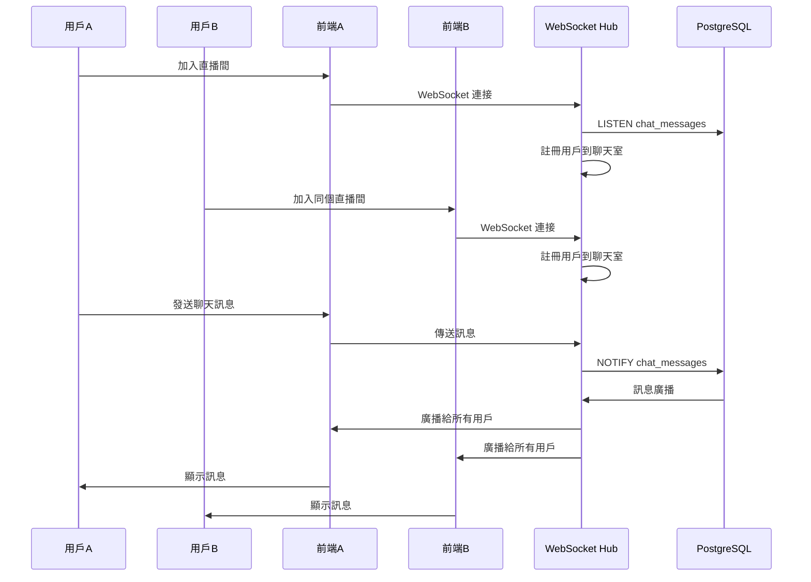

### 用戶認證流程
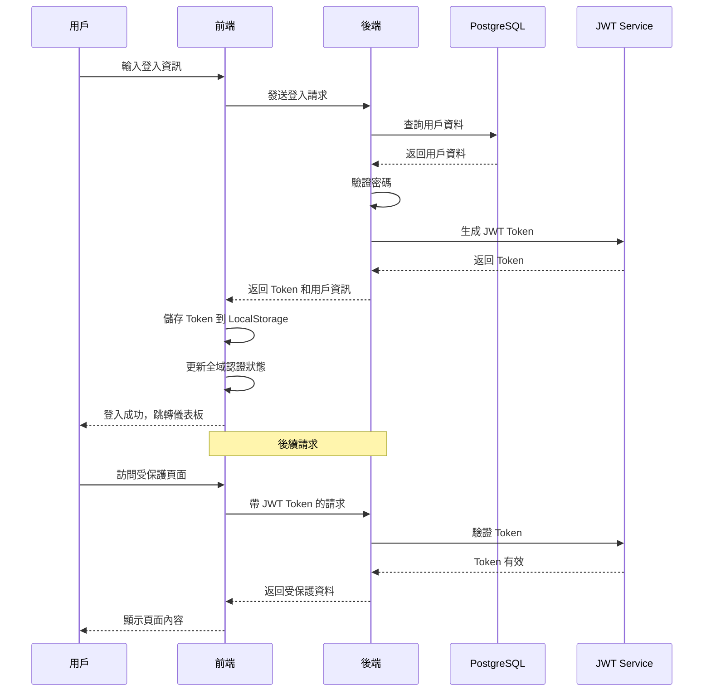

## 🛠️ 部署架構

### Docker 容器部署
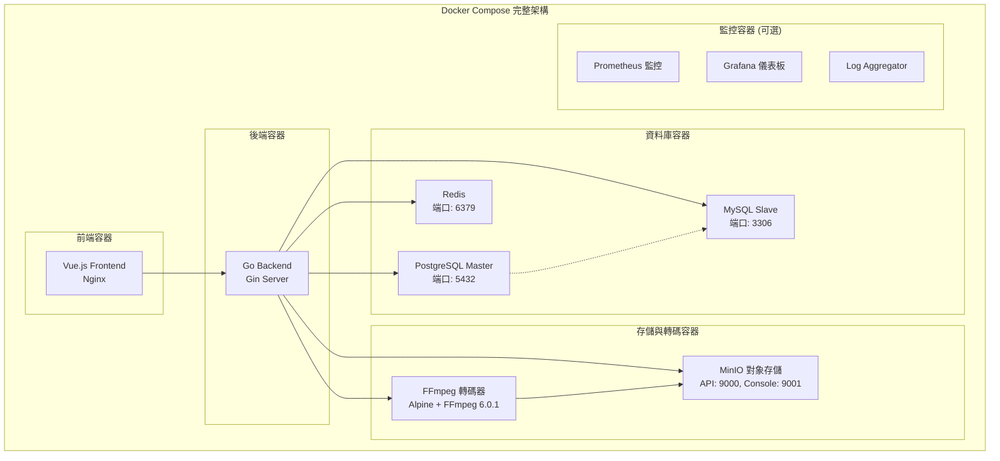

### 🚀 快速開始

#### 環境要求
- Docker & Docker Compose
- Go 1.24.3+
- Node.js 18+

#### 啟動完整開發環境

```bash
# 克隆專案
git clone <repository-url>
cd stream-demo

# 啟動所有 Docker 服務
docker-compose up -d

# 檢查服務狀態
docker-compose ps
```

#### 服務端口說明

| 服務 | 端口 | 描述 |
|------|------|------|
| PostgreSQL | 5432 | 主資料庫 |
| MySQL | 3306 | 從資料庫 |
| Redis | 6379 | 緩存與訊息佇列 |
| MinIO API | 9000 | S3 兼容 API |
| MinIO Console | 9001 | 管理界面 |
| Go 後端 | 8080 | REST API 服務 |
| Vue 前端 | 3000 | 開發伺服器 |

#### MinIO 初始設置

```bash
# MinIO 管理界面
http://localhost:9001
# 默認帳號: minioadmin / minioadmin

# 創建初始儲存桶
docker exec stream-demo-minio mc alias set local http://localhost:9000 minioadmin minioadmin
docker exec stream-demo-minio mc mb local/stream-demo-videos
docker exec stream-demo-minio mc mb local/stream-demo-processed
docker exec stream-demo-minio mc anonymous set public local/stream-demo-videos
docker exec stream-demo-minio mc anonymous set public local/stream-demo-processed
```

#### 測試轉碼功能

```bash
# 1. 啟動後端服務
cd backend && go run main.go

# 2. 上傳測試影片（透過前端或 API）
# 前端: http://localhost:3000
# 後端 API: http://localhost:8080

# 3. 檢查轉碼狀態
docker logs stream-demo-transcoder

# 4. 查看轉碼結果
docker exec stream-demo-transcoder mc ls s3/stream-demo-processed/videos/processed/ --recursive

# 5. 手動測試轉碼（可選）
docker exec stream-demo-transcoder /scripts/transcode.sh \
  "videos/original/1/test.mov" \
  "videos/processed/1/1" \
  "1" \
  "1"
```

#### 轉碼後檔案格式

- **MP4 版本**: `stream-demo-processed/videos/processed/{user_id}/{video_id}/video.mp4` - 最佳瀏覽器相容性
- **HLS 串流**: `stream-demo-processed/videos/processed/{user_id}/{video_id}/hls/index.m3u8` - 多品質適應性串流
- **縮圖**: `stream-demo-processed/videos/processed/{user_id}/{video_id}/thumbnails/` - 多尺寸預覽圖

---

## 🚀 **最新更新 (2025-01)**

### ✨ **完整的影片上傳與自動轉檔系統**

我們已經實現了完整的影片上傳與自動轉檔系統，包括：

#### 🔧 **核心功能實現**
- ✅ **雙桶存儲架構**: 原始檔案存儲於 `stream-demo-videos`，轉碼後檔案存儲於 `stream-demo-processed`
- ✅ **背景轉碼服務**: `TranscodeWorker` 自動監控資料庫，處理待轉碼影片
- ✅ **智能檔案管理**: 使用 UUID 命名原始檔案，避免衝突
- ✅ **多品質轉碼**: 720p、480p、360p HLS 串流 + MP4 網頁版本
- ✅ **比例保持**: 使用 `scale=width:-1` 保持原始影片比例，支援垂直影片
- ✅ **縮圖生成**: 多尺寸縮圖 + 時間軸預覽圖

#### 🎯 **轉碼流程優化**
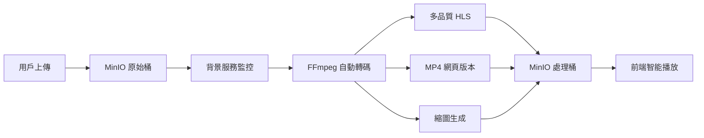

#### 📂 **檔案結構優化**
- **原始檔案**: `stream-demo-videos/videos/original/{user_id}/{uuid}.{ext}` - 永久保留
- **轉碼產出**: `stream-demo-processed/videos/processed/{user_id}/{video_id}/` - 多格式組織
- **智能播放**: 前端優先使用 MP4 → HLS → 原始檔案

#### 🐳 **Docker 完整化**
- **PostgreSQL + MySQL + Redis**: 完整資料庫支援
- **MinIO**: S3 兼容對象存儲 (API: 9000, Console: 9001)
- **FFmpeg Transcoder**: 專用轉碼容器，支援 Alpine + MinIO Client

#### ⚡ **效能提升**
- **本地化處理**: 無需 AWS 服務，降低成本和延遲
- **並行轉碼**: 同時生成多品質版本
- **智能觸發**: 所有上傳影片都會進行轉碼
- **瀏覽器優化**: MP4 優先確保最佳相容性

#### 🎮 **前端播放體驗**
- **自動載入**: 進入影片詳情頁自動載入影片資源
- **智能品質切換**: 根據網路狀況自動切換品質
- **比例保持**: 垂直影片正確顯示，不會被壓縮
- **即時反饋**: 轉碼中狀態提示，完成後自動刷新

#### 🔄 **背景服務特色**
- **SELECT FOR UPDATE**: 防止並發處理同一影片
- **事務管理**: 確保資料庫操作原子性
- **錯誤處理**: 完善的錯誤記錄和重試機制
- **狀態追蹤**: 詳細的處理進度和狀態更新

---

**開發環境現在只需一個命令即可完整啟動！** 🎉
```bash
docker-compose up -d
```